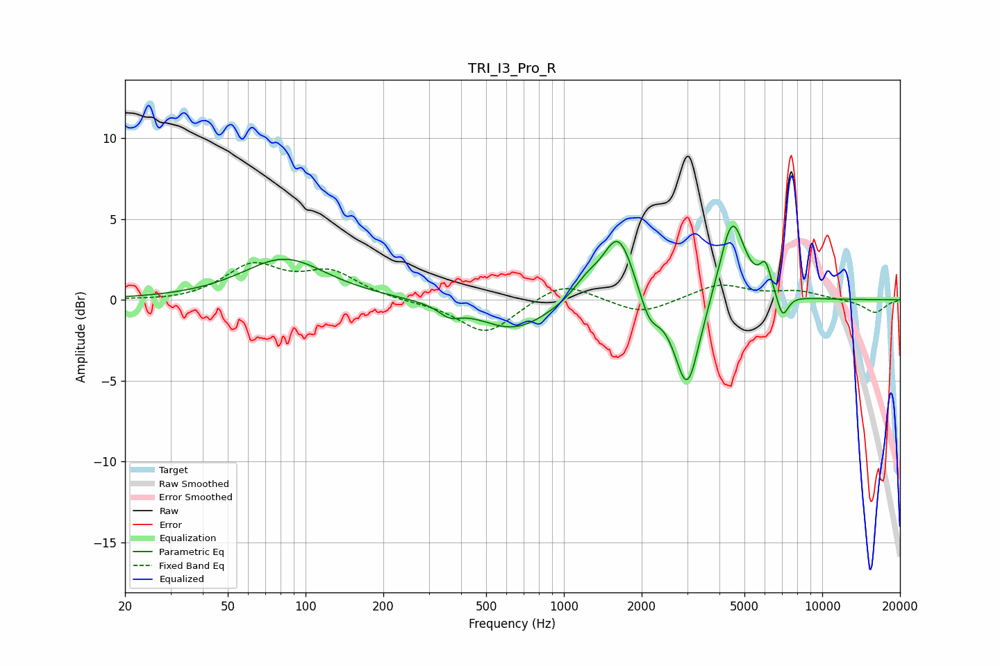

# TRI_I3_Pro_R
See [usage instructions](https://github.com/jaakkopasanen/AutoEq#usage) for more options and info.

### Parametric EQs
Apply preamp of -4.7 dB when using parametric equalizer.

|   # | Type    |   Fc (Hz) |    Q |   Gain (dB) |
|-----|---------|-----------|------|-------------|
|   1 | Peaking |        83 | 0.89 |         2.5 |
|   2 | Peaking |       361 | 3.47 |        -0.6 |
|   3 | Peaking |       641 | 1.04 |        -1.9 |
|   4 | Peaking |      1225 | 2.57 |         1   |
|   5 | Peaking |      1628 | 2.32 |         4.2 |
|   6 | Peaking |      2143 | 3.64 |        -1.6 |
|   7 | Peaking |      3002 | 2.88 |        -5.9 |
|   8 | Peaking |      4479 | 2.88 |         5.3 |
|   9 | Peaking |      6036 | 5.96 |         1.7 |
|  10 | Peaking |      7019 | 6    |        -1.5 |

### Fixed Band EQs
When using fixed band (also called graphic) equalizer, apply preamp of **-2.4 dB** (if available) and set gains manually with these parameters.

|   # | Type    |   Fc (Hz) |    Q |   Gain (dB) |
|-----|---------|-----------|------|-------------|
|   1 | Peaking |        31 | 1.41 |        -0.1 |
|   2 | Peaking |        62 | 1.41 |         2   |
|   3 | Peaking |       125 | 1.41 |         1.6 |
|   4 | Peaking |       250 | 1.41 |        -0.1 |
|   5 | Peaking |       500 | 1.41 |        -2.1 |
|   6 | Peaking |      1000 | 1.41 |         1.2 |
|   7 | Peaking |      2000 | 1.41 |        -0.9 |
|   8 | Peaking |      4000 | 1.41 |         1   |
|   9 | Peaking |      8000 | 1.41 |         0.5 |
|  10 | Peaking |     16000 | 1.41 |        -0.8 |

### Graphs

