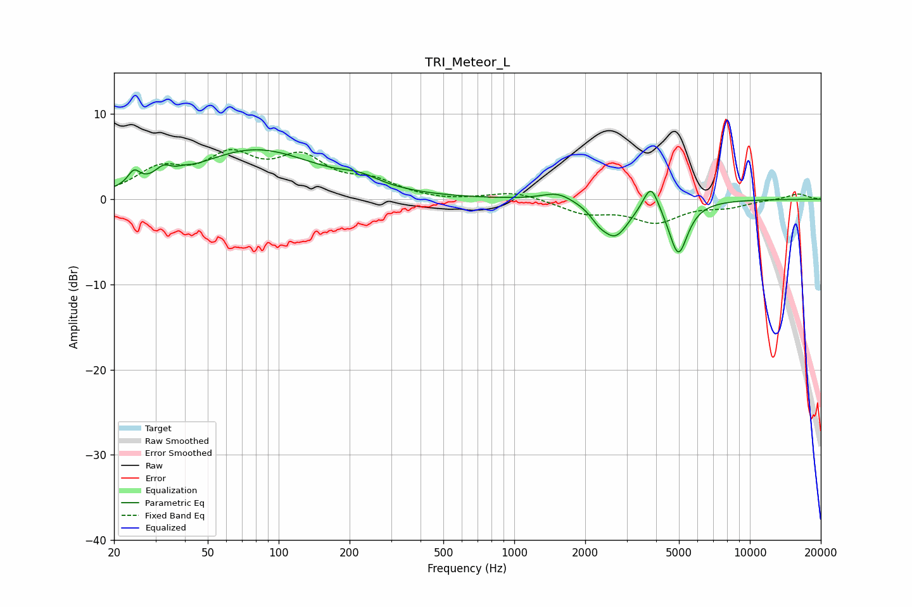

# TRI_Meteor_L
See [usage instructions](https://github.com/jaakkopasanen/AutoEq#usage) for more options and info.

### Parametric EQs
Apply preamp of -5.9 dB when using parametric equalizer.

|   # | Type    |   Fc (Hz) |    Q |   Gain (dB) |
|-----|---------|-----------|------|-------------|
|   1 | Peaking |        24 | 5.75 |         1.6 |
|   2 | Peaking |        32 | 4.23 |         1.3 |
|   3 | Peaking |        40 | 5.98 |         0.2 |
|   4 | Peaking |        80 | 0.54 |         5.7 |
|   5 | Peaking |       222 | 1.72 |         1   |
|   6 | Peaking |      1530 | 2.18 |         1   |
|   7 | Peaking |      2278 | 4.38 |        -0.8 |
|   8 | Peaking |      2676 | 2.32 |        -4.2 |
|   9 | Peaking |      3803 | 4.3  |         3.3 |
|  10 | Peaking |      4969 | 3.49 |        -6.3 |

### Fixed Band EQs
When using fixed band (also called graphic) equalizer, apply preamp of **-5.9 dB** (if available) and set gains manually with these parameters.

|   # | Type    |   Fc (Hz) |    Q |   Gain (dB) |
|-----|---------|-----------|------|-------------|
|   1 | Peaking |        31 | 1.41 |         3.1 |
|   2 | Peaking |        62 | 1.41 |         4.4 |
|   3 | Peaking |       125 | 1.41 |         4.3 |
|   4 | Peaking |       250 | 1.41 |         1.8 |
|   5 | Peaking |       500 | 1.41 |        -0.3 |
|   6 | Peaking |      1000 | 1.41 |         0.9 |
|   7 | Peaking |      2000 | 1.41 |        -1.5 |
|   8 | Peaking |      4000 | 1.41 |        -2.5 |
|   9 | Peaking |      8000 | 1.41 |        -0.8 |
|  10 | Peaking |     16000 | 1.41 |         0.7 |

### Graphs

