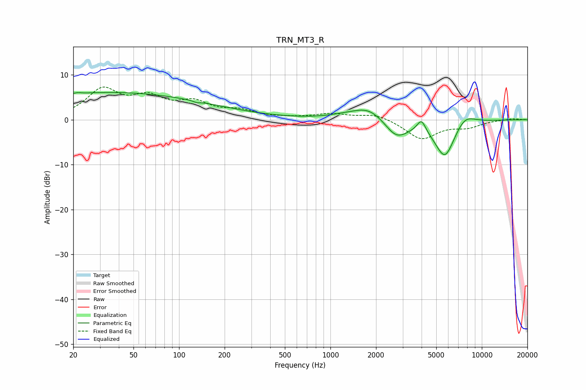

# TRN_MT3_R
See [usage instructions](https://github.com/jaakkopasanen/AutoEq#usage) for more options and info.

### Parametric EQs
Apply preamp of -6.1 dB when using parametric equalizer.

|   # | Type    |   Fc (Hz) |    Q |   Gain (dB) |
|-----|---------|-----------|------|-------------|
|   1 | Peaking |        21 | 5.77 |         0.3 |
|   2 | Peaking |        25 | 0.24 |         1.6 |
|   3 | Peaking |        42 | 0.19 |         4.5 |
|   4 | Peaking |       131 | 5.9  |        -0.3 |
|   5 | Peaking |      1223 | 1.35 |         0.5 |
|   6 | Peaking |      1802 | 1.32 |         3   |
|   7 | Peaking |      2732 | 1.75 |        -4.2 |
|   8 | Peaking |      3992 | 4.89 |         2.8 |
|   9 | Peaking |      5705 | 1.98 |        -8.6 |
|  10 | Peaking |      7670 | 1.95 |         2.7 |

### Fixed Band EQs
When using fixed band (also called graphic) equalizer, apply preamp of **-7.4 dB** (if available) and set gains manually with these parameters.

|   # | Type    |   Fc (Hz) |    Q |   Gain (dB) |
|-----|---------|-----------|------|-------------|
|   1 | Peaking |        31 | 1.41 |         6.3 |
|   2 | Peaking |        62 | 1.41 |         4.1 |
|   3 | Peaking |       125 | 1.41 |         3.3 |
|   4 | Peaking |       250 | 1.41 |         1.7 |
|   5 | Peaking |       500 | 1.41 |         0.2 |
|   6 | Peaking |      1000 | 1.41 |         1.2 |
|   7 | Peaking |      2000 | 1.41 |         1.3 |
|   8 | Peaking |      4000 | 1.41 |        -4.3 |
|   9 | Peaking |      8000 | 1.41 |        -1.4 |
|  10 | Peaking |     16000 | 1.41 |         0.3 |

### Graphs

