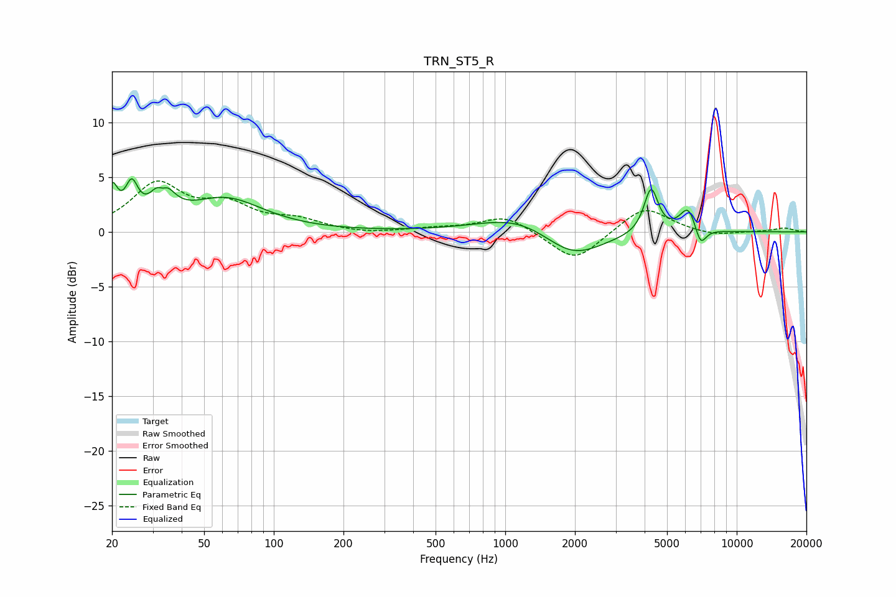

# TRN_ST5_R
See [usage instructions](https://github.com/jaakkopasanen/AutoEq#usage) for more options and info.

### Parametric EQs
Apply preamp of -5.0 dB when using parametric equalizer.

|   # | Type    |   Fc (Hz) |    Q |   Gain (dB) |
|-----|---------|-----------|------|-------------|
|   1 | Peaking |        20 | 5.94 |         3.2 |
|   2 | Peaking |        24 | 5.21 |         3.1 |
|   3 | Peaking |        33 | 3.77 |         4.6 |
|   4 | Peaking |        33 | 5.99 |        -2.3 |
|   5 | Peaking |        62 | 0.87 |         3   |
|   6 | Peaking |      1165 | 0.82 |         1.7 |
|   7 | Peaking |      1951 | 1.07 |        -2.7 |
|   8 | Peaking |      4266 | 4.67 |         4.1 |
|   9 | Peaking |      6183 | 3.79 |         2.4 |
|  10 | Peaking |      6967 | 5.41 |        -1.9 |

### Fixed Band EQs
When using fixed band (also called graphic) equalizer, apply preamp of **-4.7 dB** (if available) and set gains manually with these parameters.

|   # | Type    |   Fc (Hz) |    Q |   Gain (dB) |
|-----|---------|-----------|------|-------------|
|   1 | Peaking |        31 | 1.41 |         4.2 |
|   2 | Peaking |        62 | 1.41 |         2.1 |
|   3 | Peaking |       125 | 1.41 |         0.9 |
|   4 | Peaking |       250 | 1.41 |        -0.2 |
|   5 | Peaking |       500 | 1.41 |         0.3 |
|   6 | Peaking |      1000 | 1.41 |         1.5 |
|   7 | Peaking |      2000 | 1.41 |        -2.8 |
|   8 | Peaking |      4000 | 1.41 |         2.4 |
|   9 | Peaking |      8000 | 1.41 |        -0.4 |
|  10 | Peaking |     16000 | 1.41 |         0.3 |

### Graphs

