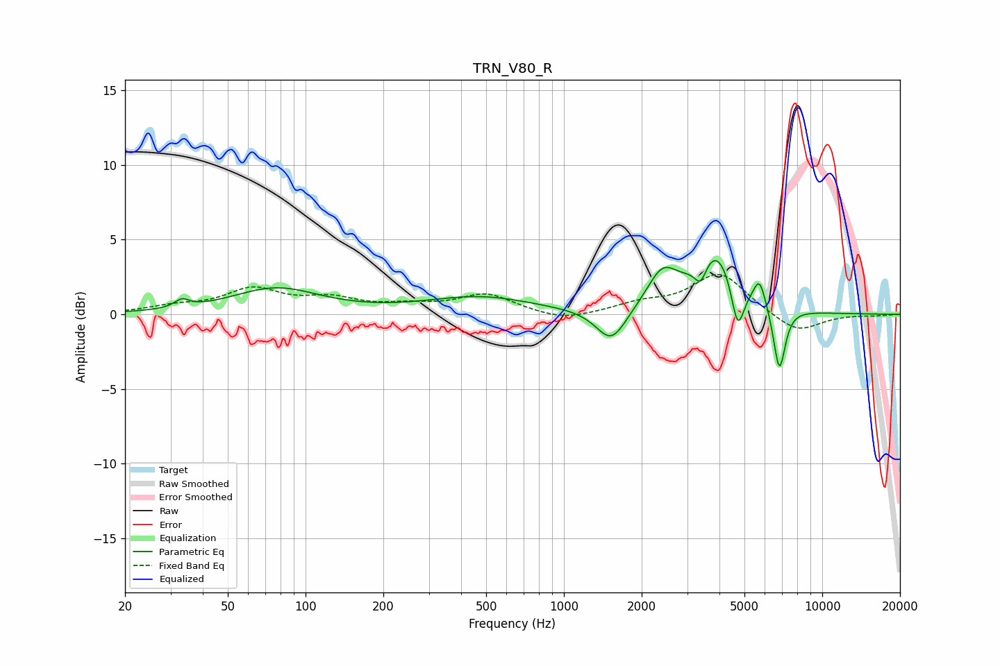

# TRN_V80_R
See [usage instructions](https://github.com/jaakkopasanen/AutoEq#usage) for more options and info.

### Parametric EQs
Apply preamp of -3.7 dB when using parametric equalizer.

|   # | Type    |   Fc (Hz) |    Q |   Gain (dB) |
|-----|---------|-----------|------|-------------|
|   1 | Peaking |        33 | 5.14 |         0.5 |
|   2 | Peaking |        77 | 0.84 |         1.7 |
|   3 | Peaking |       472 | 0.68 |         1.1 |
|   4 | Peaking |      1528 | 2.42 |        -2.3 |
|   5 | Peaking |      2407 | 2.37 |         2.4 |
|   6 | Peaking |      3385 | 5.94 |        -1.5 |
|   7 | Peaking |      3867 | 1.72 |         4.2 |
|   8 | Peaking |      4707 | 5.67 |        -3.3 |
|   9 | Peaking |      5719 | 6    |         1.8 |
|  10 | Peaking |      6825 | 6    |        -4.3 |

### Fixed Band EQs
When using fixed band (also called graphic) equalizer, apply preamp of **-2.8 dB** (if available) and set gains manually with these parameters.

|   # | Type    |   Fc (Hz) |    Q |   Gain (dB) |
|-----|---------|-----------|------|-------------|
|   1 | Peaking |        31 | 1.41 |         0.4 |
|   2 | Peaking |        62 | 1.41 |         1.6 |
|   3 | Peaking |       125 | 1.41 |         0.9 |
|   4 | Peaking |       250 | 1.41 |         0.4 |
|   5 | Peaking |       500 | 1.41 |         1.3 |
|   6 | Peaking |      1000 | 1.41 |        -0.5 |
|   7 | Peaking |      2000 | 1.41 |         0.6 |
|   8 | Peaking |      4000 | 1.41 |         2.7 |
|   9 | Peaking |      8000 | 1.41 |        -1.3 |
|  10 | Peaking |     16000 | 1.41 |        -0.1 |

### Graphs

