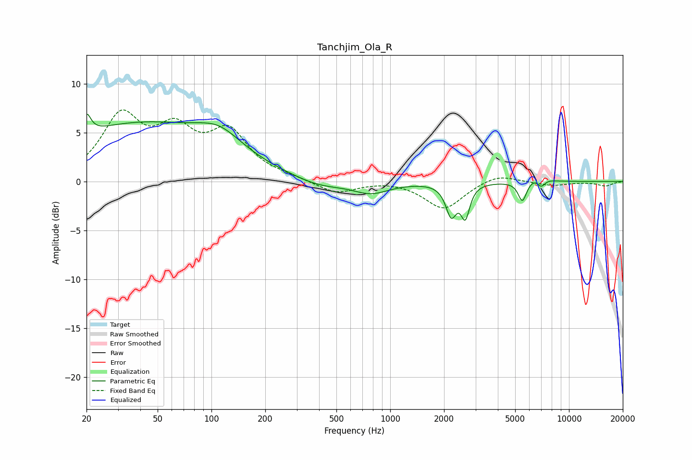

# Tanchjim_Ola_R
See [usage instructions](https://github.com/jaakkopasanen/AutoEq#usage) for more options and info.

### Parametric EQs
Apply preamp of -7.0 dB when using parametric equalizer.

|   # | Type    |   Fc (Hz) |    Q |   Gain (dB) |
|-----|---------|-----------|------|-------------|
|   1 | Peaking |        20 | 5.99 |         2   |
|   2 | Peaking |        39 | 0.3  |         5.8 |
|   3 | Peaking |       111 | 1.12 |         2   |
|   4 | Peaking |       399 | 1.03 |        -0.8 |
|   5 | Peaking |       781 | 1.39 |        -1.2 |
|   6 | Peaking |      2194 | 4.79 |        -3.1 |
|   7 | Peaking |      2632 | 5.95 |        -3.1 |
|   8 | Peaking |      5486 | 6    |        -2.1 |
|   9 | Peaking |      6882 | 3.51 |         2.6 |
|  10 | Peaking |      6945 | 4.51 |        -2.8 |

### Fixed Band EQs
When using fixed band (also called graphic) equalizer, apply preamp of **-7.4 dB** (if available) and set gains manually with these parameters.

|   # | Type    |   Fc (Hz) |    Q |   Gain (dB) |
|-----|---------|-----------|------|-------------|
|   1 | Peaking |        31 | 1.41 |         6.3 |
|   2 | Peaking |        62 | 1.41 |         4.4 |
|   3 | Peaking |       125 | 1.41 |         4.6 |
|   4 | Peaking |       250 | 1.41 |         0.3 |
|   5 | Peaking |       500 | 1.41 |        -1.2 |
|   6 | Peaking |      1000 | 1.41 |         0.2 |
|   7 | Peaking |      2000 | 1.41 |        -2.8 |
|   8 | Peaking |      4000 | 1.41 |         0.9 |
|   9 | Peaking |      8000 | 1.41 |        -0.4 |
|  10 | Peaking |     16000 | 1.41 |        -0.4 |

### Graphs

