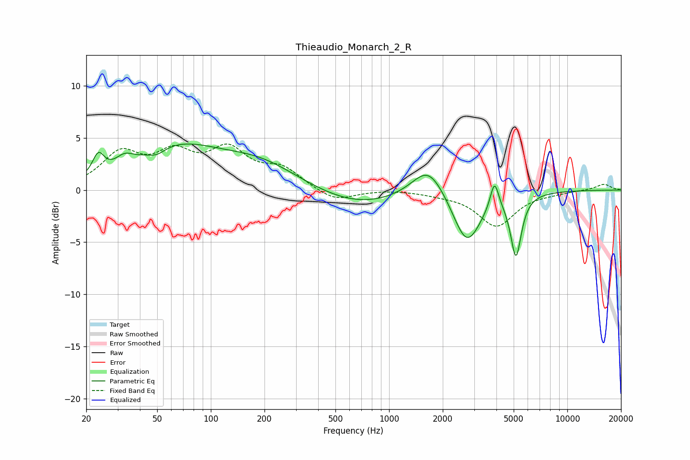

# Thieaudio_Monarch_2_R
See [usage instructions](https://github.com/jaakkopasanen/AutoEq#usage) for more options and info.

### Parametric EQs
Apply preamp of -4.5 dB when using parametric equalizer.

|   # | Type    |   Fc (Hz) |    Q |   Gain (dB) |
|-----|---------|-----------|------|-------------|
|   1 | Peaking |        23 | 4.4  |         2   |
|   2 | Peaking |        33 | 2.8  |         1.1 |
|   3 | Peaking |        50 | 3.11 |        -0.6 |
|   4 | Peaking |        65 | 0.59 |         3.8 |
|   5 | Peaking |       189 | 0.63 |         2.3 |
|   6 | Peaking |       663 | 0.57 |        -1.6 |
|   7 | Peaking |      1664 | 1.54 |         3.1 |
|   8 | Peaking |      2730 | 1.8  |        -5.2 |
|   9 | Peaking |      3902 | 6    |         2.7 |
|  10 | Peaking |      5150 | 4.68 |        -5.9 |

### Fixed Band EQs
When using fixed band (also called graphic) equalizer, apply preamp of **-4.5 dB** (if available) and set gains manually with these parameters.

|   # | Type    |   Fc (Hz) |    Q |   Gain (dB) |
|-----|---------|-----------|------|-------------|
|   1 | Peaking |        31 | 1.41 |         3.3 |
|   2 | Peaking |        62 | 1.41 |         3   |
|   3 | Peaking |       125 | 1.41 |         3.4 |
|   4 | Peaking |       250 | 1.41 |         1.8 |
|   5 | Peaking |       500 | 1.41 |        -1.2 |
|   6 | Peaking |      1000 | 1.41 |         0.1 |
|   7 | Peaking |      2000 | 1.41 |        -0.3 |
|   8 | Peaking |      4000 | 1.41 |        -3.4 |
|   9 | Peaking |      8000 | 1.41 |        -0.2 |
|  10 | Peaking |     16000 | 1.41 |         0.6 |

### Graphs

