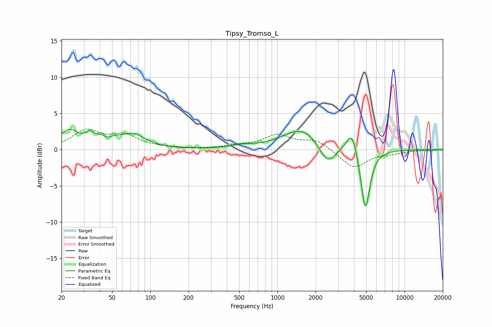

# Tipsy_Tromso_L
See [usage instructions](https://github.com/jaakkopasanen/AutoEq#usage) for more options and info.

### Parametric EQs
Apply preamp of -2.9 dB when using parametric equalizer.

|   # | Type    |   Fc (Hz) |    Q |   Gain (dB) |
|-----|---------|-----------|------|-------------|
|   1 | Peaking |        23 | 1.97 |         2.4 |
|   2 | Peaking |        33 | 4.79 |         0.9 |
|   3 | Peaking |        45 | 1.94 |         2.1 |
|   4 | Peaking |        46 | 3.61 |        -1.3 |
|   5 | Peaking |        74 | 1.45 |         1.8 |
|   6 | Peaking |       519 | 1.55 |         0.4 |
|   7 | Peaking |      1560 | 0.95 |         3   |
|   8 | Peaking |      2468 | 2.22 |        -2.9 |
|   9 | Peaking |      3854 | 3.42 |         3.2 |
|  10 | Peaking |      4917 | 3.9  |        -8.7 |

### Fixed Band EQs
When using fixed band (also called graphic) equalizer, apply preamp of **-2.9 dB** (if available) and set gains manually with these parameters.

|   # | Type    |   Fc (Hz) |    Q |   Gain (dB) |
|-----|---------|-----------|------|-------------|
|   1 | Peaking |        31 | 1.41 |         2.5 |
|   2 | Peaking |        62 | 1.41 |         1.8 |
|   3 | Peaking |       125 | 1.41 |         0.2 |
|   4 | Peaking |       250 | 1.41 |         0.1 |
|   5 | Peaking |       500 | 1.41 |         0.4 |
|   6 | Peaking |      1000 | 1.41 |         1.9 |
|   7 | Peaking |      2000 | 1.41 |         1.3 |
|   8 | Peaking |      4000 | 1.41 |        -2.6 |
|   9 | Peaking |      8000 | 1.41 |        -0.4 |
|  10 | Peaking |     16000 | 1.41 |        -0.1 |

### Graphs

