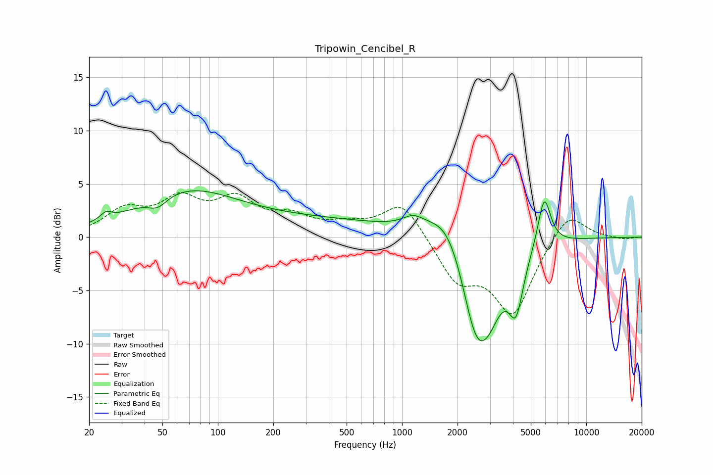

# Tripowin_Cencibel_R
See [usage instructions](https://github.com/jaakkopasanen/AutoEq#usage) for more options and info.

### Parametric EQs
Apply preamp of -4.4 dB when using parametric equalizer.

|   # | Type    |   Fc (Hz) |    Q |   Gain (dB) |
|-----|---------|-----------|------|-------------|
|   1 | Peaking |        25 | 4.82 |         0.7 |
|   2 | Peaking |        47 | 2.72 |        -1.1 |
|   3 | Peaking |        67 | 0.5  |         4.1 |
|   4 | Peaking |       379 | 0.33 |         1.4 |
|   5 | Peaking |      1148 | 2.42 |         1   |
|   6 | Peaking |      1812 | 1.25 |         4.1 |
|   7 | Peaking |      2527 | 1.52 |        -9.9 |
|   8 | Peaking |      2990 | 2.08 |        -2.6 |
|   9 | Peaking |      4157 | 3.52 |        -5   |
|  10 | Peaking |      5914 | 3.93 |         4.9 |

### Fixed Band EQs
When using fixed band (also called graphic) equalizer, apply preamp of **-4.3 dB** (if available) and set gains manually with these parameters.

|   # | Type    |   Fc (Hz) |    Q |   Gain (dB) |
|-----|---------|-----------|------|-------------|
|   1 | Peaking |        31 | 1.41 |         2.3 |
|   2 | Peaking |        62 | 1.41 |         3.1 |
|   3 | Peaking |       125 | 1.41 |         3.1 |
|   4 | Peaking |       250 | 1.41 |         1.6 |
|   5 | Peaking |       500 | 1.41 |         0.9 |
|   6 | Peaking |      1000 | 1.41 |         3.4 |
|   7 | Peaking |      2000 | 1.41 |        -3.9 |
|   8 | Peaking |      4000 | 1.41 |        -7   |
|   9 | Peaking |      8000 | 1.41 |         2.7 |
|  10 | Peaking |     16000 | 1.41 |        -0.2 |

### Graphs

