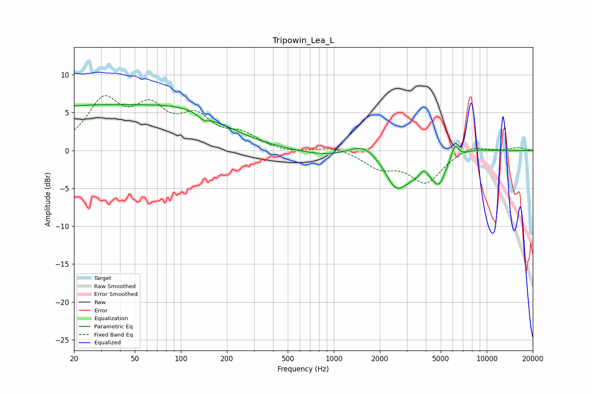

# Tripowin_Lea_L
See [usage instructions](https://github.com/jaakkopasanen/AutoEq#usage) for more options and info.

### Parametric EQs
Apply preamp of -6.1 dB when using parametric equalizer.

|   # | Type    |   Fc (Hz) |    Q |   Gain (dB) |
|-----|---------|-----------|------|-------------|
|   1 | Peaking |        20 | 0.26 |         5.5 |
|   2 | Peaking |       115 | 0.53 |         3.6 |
|   3 | Peaking |       141 | 3.9  |        -0.7 |
|   4 | Peaking |      1637 | 1.03 |         5.1 |
|   5 | Peaking |      2321 | 0.5  |        -5.5 |
|   6 | Peaking |      2552 | 2.47 |        -2.2 |
|   7 | Peaking |      3865 | 5.58 |         1.1 |
|   8 | Peaking |      4868 | 3.62 |        -2.5 |
|   9 | Peaking |      6189 | 5.54 |         2.2 |
|  10 | Peaking |      7941 | 0.99 |         1.1 |

### Fixed Band EQs
When using fixed band (also called graphic) equalizer, apply preamp of **-7.3 dB** (if available) and set gains manually with these parameters.

|   # | Type    |   Fc (Hz) |    Q |   Gain (dB) |
|-----|---------|-----------|------|-------------|
|   1 | Peaking |        31 | 1.41 |         6.2 |
|   2 | Peaking |        62 | 1.41 |         4.8 |
|   3 | Peaking |       125 | 1.41 |         3.8 |
|   4 | Peaking |       250 | 1.41 |         1.8 |
|   5 | Peaking |       500 | 1.41 |        -0.4 |
|   6 | Peaking |      1000 | 1.41 |         0.6 |
|   7 | Peaking |      2000 | 1.41 |        -2.1 |
|   8 | Peaking |      4000 | 1.41 |        -4.1 |
|   9 | Peaking |      8000 | 1.41 |         0.8 |
|  10 | Peaking |     16000 | 1.41 |         0.4 |

### Graphs

