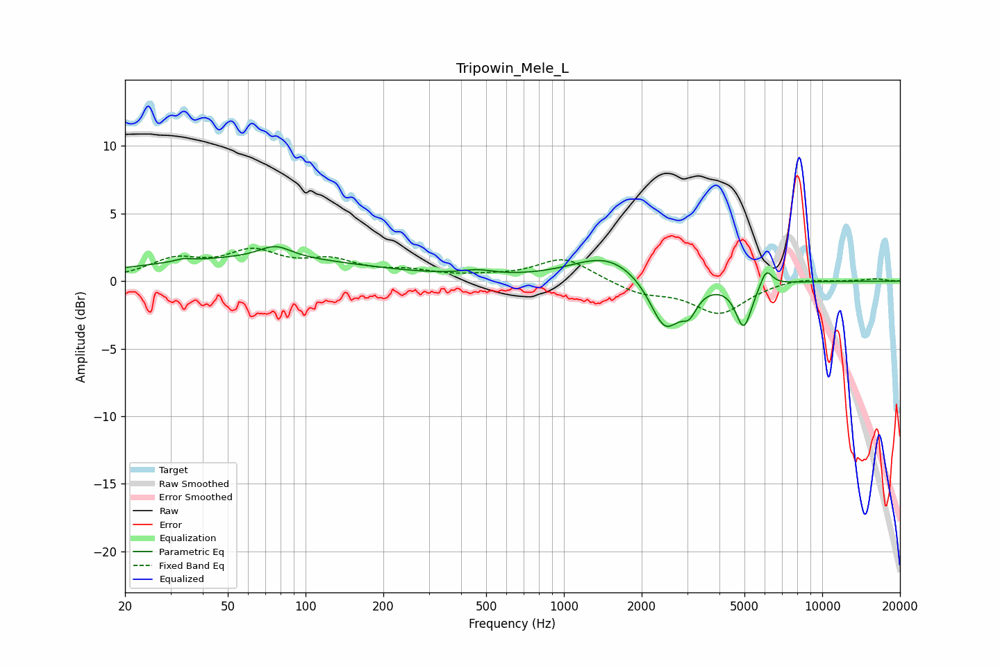

# Tripowin_Mele_L
See [usage instructions](https://github.com/jaakkopasanen/AutoEq#usage) for more options and info.

### Parametric EQs
Apply preamp of -2.7 dB when using parametric equalizer.

|   # | Type    |   Fc (Hz) |    Q |   Gain (dB) |
|-----|---------|-----------|------|-------------|
|   1 | Peaking |        34 | 4.75 |         0.2 |
|   2 | Peaking |        63 | 0.29 |         1.6 |
|   3 | Peaking |        76 | 2.27 |         0.9 |
|   4 | Peaking |       195 | 0.99 |        -0   |
|   5 | Peaking |       462 | 2.22 |         0.4 |
|   6 | Peaking |      1484 | 1.02 |         2   |
|   7 | Peaking |      2463 | 2.4  |        -3.9 |
|   8 | Peaking |      3058 | 4.68 |        -1.4 |
|   9 | Peaking |      4967 | 4.48 |        -3.3 |
|  10 | Peaking |      6071 | 6    |         1.3 |

### Fixed Band EQs
When using fixed band (also called graphic) equalizer, apply preamp of **-2.5 dB** (if available) and set gains manually with these parameters.

|   # | Type    |   Fc (Hz) |    Q |   Gain (dB) |
|-----|---------|-----------|------|-------------|
|   1 | Peaking |        31 | 1.41 |         1.4 |
|   2 | Peaking |        62 | 1.41 |         1.9 |
|   3 | Peaking |       125 | 1.41 |         1.3 |
|   4 | Peaking |       250 | 1.41 |         0.6 |
|   5 | Peaking |       500 | 1.41 |         0.2 |
|   6 | Peaking |      1000 | 1.41 |         1.7 |
|   7 | Peaking |      2000 | 1.41 |        -0.9 |
|   8 | Peaking |      4000 | 1.41 |        -2.3 |
|   9 | Peaking |      8000 | 1.41 |         0.3 |
|  10 | Peaking |     16000 | 1.41 |         0.2 |

### Graphs

