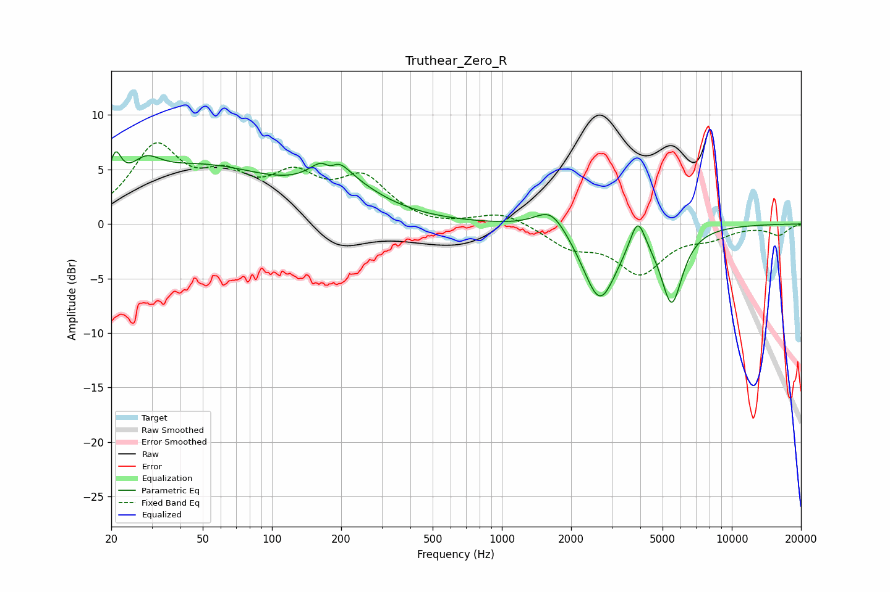

# Truthear_Zero_R
See [usage instructions](https://github.com/jaakkopasanen/AutoEq#usage) for more options and info.

### Parametric EQs
Apply preamp of -6.7 dB when using parametric equalizer.

|   # | Type    |   Fc (Hz) |    Q |   Gain (dB) |
|-----|---------|-----------|------|-------------|
|   1 | Peaking |        21 | 5.82 |         2.8 |
|   2 | Peaking |        28 | 2.3  |         1.8 |
|   3 | Peaking |        48 | 0.42 |         5.1 |
|   4 | Peaking |       179 | 4.14 |        -2.6 |
|   5 | Peaking |       179 | 2.49 |         4.4 |
|   6 | Peaking |       216 | 0.86 |         2.1 |
|   7 | Peaking |      1639 | 2.08 |         2.2 |
|   8 | Peaking |      2665 | 1.9  |        -7   |
|   9 | Peaking |      3895 | 4.35 |         3.1 |
|  10 | Peaking |      5479 | 2.96 |        -6.8 |

### Fixed Band EQs
When using fixed band (also called graphic) equalizer, apply preamp of **-7.5 dB** (if available) and set gains manually with these parameters.

|   # | Type    |   Fc (Hz) |    Q |   Gain (dB) |
|-----|---------|-----------|------|-------------|
|   1 | Peaking |        31 | 1.41 |         6.7 |
|   2 | Peaking |        62 | 1.41 |         3.3 |
|   3 | Peaking |       125 | 1.41 |         3.6 |
|   4 | Peaking |       250 | 1.41 |         3.8 |
|   5 | Peaking |       500 | 1.41 |        -0.3 |
|   6 | Peaking |      1000 | 1.41 |         1.1 |
|   7 | Peaking |      2000 | 1.41 |        -1.9 |
|   8 | Peaking |      4000 | 1.41 |        -4.3 |
|   9 | Peaking |      8000 | 1.41 |        -1   |
|  10 | Peaking |     16000 | 1.41 |        -1   |

### Graphs

