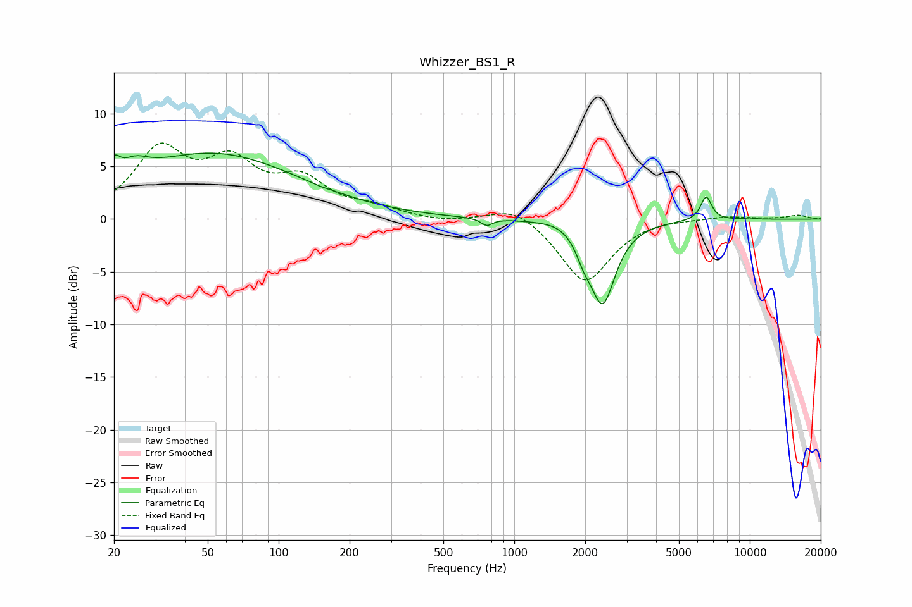

# Whizzer_BS1_R
See [usage instructions](https://github.com/jaakkopasanen/AutoEq#usage) for more options and info.

### Parametric EQs
Apply preamp of -6.4 dB when using parametric equalizer.

|   # | Type    |   Fc (Hz) |    Q |   Gain (dB) |
|-----|---------|-----------|------|-------------|
|   1 | Peaking |        20 | 5.69 |         1.8 |
|   2 | Peaking |        24 | 2.42 |         1.4 |
|   3 | Peaking |        53 | 0.38 |         6.2 |
|   4 | Peaking |       150 | 5.68 |        -0.1 |
|   5 | Peaking |       764 | 5.93 |        -0.7 |
|   6 | Peaking |      1563 | 1.91 |         0.4 |
|   7 | Peaking |      1976 | 4.42 |        -1.4 |
|   8 | Peaking |      2372 | 2.62 |        -7.8 |
|   9 | Peaking |      6523 | 5.9  |         2.3 |
|  10 | Peaking |     10000 | 6    |         0.1 |

### Fixed Band EQs
When using fixed band (also called graphic) equalizer, apply preamp of **-7.3 dB** (if available) and set gains manually with these parameters.

|   # | Type    |   Fc (Hz) |    Q |   Gain (dB) |
|-----|---------|-----------|------|-------------|
|   1 | Peaking |        31 | 1.41 |         6.2 |
|   2 | Peaking |        62 | 1.41 |         4.6 |
|   3 | Peaking |       125 | 1.41 |         3.3 |
|   4 | Peaking |       250 | 1.41 |         0.9 |
|   5 | Peaking |       500 | 1.41 |        -0.3 |
|   6 | Peaking |      1000 | 1.41 |         1.5 |
|   7 | Peaking |      2000 | 1.41 |        -6.1 |
|   8 | Peaking |      4000 | 1.41 |         0.2 |
|   9 | Peaking |      8000 | 1.41 |         0.3 |
|  10 | Peaking |     16000 | 1.41 |         0.4 |

### Graphs

