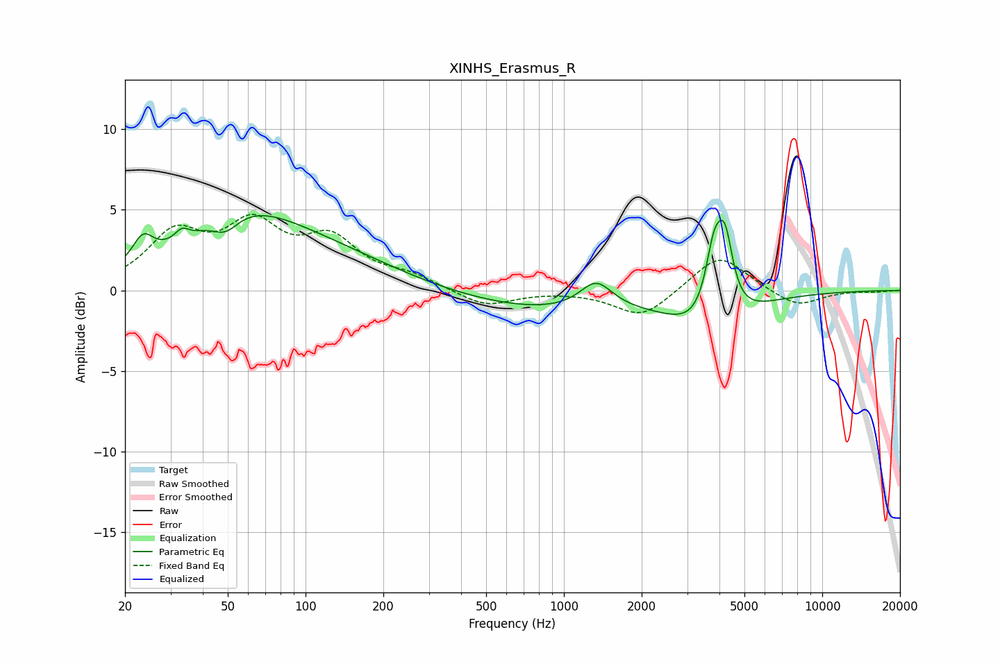

# XINHS_Erasmus_R
See [usage instructions](https://github.com/jaakkopasanen/AutoEq#usage) for more options and info.

### Parametric EQs
Apply preamp of -4.7 dB when using parametric equalizer.

|   # | Type    |   Fc (Hz) |    Q |   Gain (dB) |
|-----|---------|-----------|------|-------------|
|   1 | Peaking |        23 | 3.63 |         1.6 |
|   2 | Peaking |        33 | 5.52 |         0.6 |
|   3 | Peaking |        49 | 2.88 |        -1   |
|   4 | Peaking |        57 | 0.59 |         4.2 |
|   5 | Peaking |       136 | 0.52 |         1.3 |
|   6 | Peaking |       860 | 0.41 |        -1.2 |
|   7 | Peaking |      1333 | 2.25 |         1.7 |
|   8 | Peaking |      3662 | 1.01 |        -2.5 |
|   9 | Peaking |      3817 | 4.07 |         4.4 |
|  10 | Peaking |      4213 | 4.64 |         4.1 |

### Fixed Band EQs
When using fixed band (also called graphic) equalizer, apply preamp of **-4.8 dB** (if available) and set gains manually with these parameters.

|   # | Type    |   Fc (Hz) |    Q |   Gain (dB) |
|-----|---------|-----------|------|-------------|
|   1 | Peaking |        31 | 1.41 |         3.2 |
|   2 | Peaking |        62 | 1.41 |         3.6 |
|   3 | Peaking |       125 | 1.41 |         2.8 |
|   4 | Peaking |       250 | 1.41 |         0.7 |
|   5 | Peaking |       500 | 1.41 |        -1   |
|   6 | Peaking |      1000 | 1.41 |        -0   |
|   7 | Peaking |      2000 | 1.41 |        -1.7 |
|   8 | Peaking |      4000 | 1.41 |         2.3 |
|   9 | Peaking |      8000 | 1.41 |        -1   |
|  10 | Peaking |     16000 | 1.41 |        -0.1 |

### Graphs

