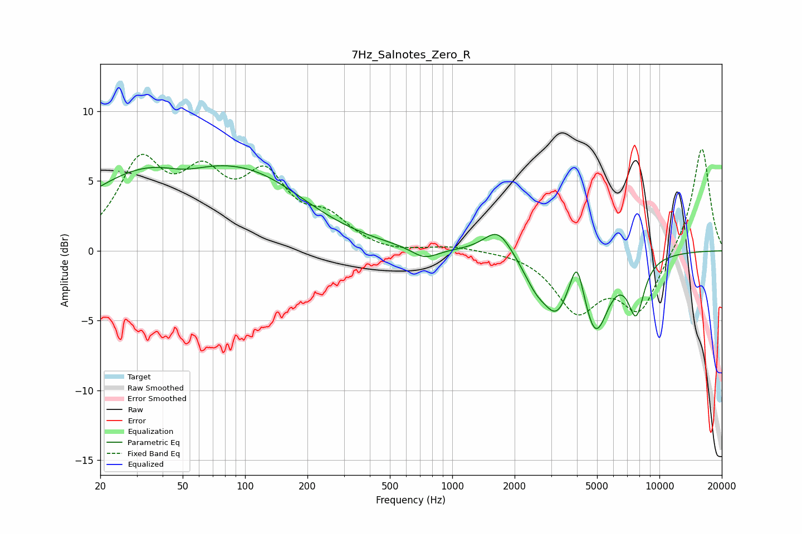

# 7Hz_Salnotes_Zero_R
See [usage instructions](https://github.com/jaakkopasanen/AutoEq#usage) for more options and info.

### Parametric EQs
Apply preamp of -6.2 dB when using parametric equalizer.

|   # | Type    |   Fc (Hz) |    Q |   Gain (dB) |
|-----|---------|-----------|------|-------------|
|   1 | Peaking |        37 | 0.39 |         5.7 |
|   2 | Peaking |        51 | 1.21 |        -1   |
|   3 | Peaking |       123 | 0.55 |         3.1 |
|   4 | Peaking |       736 | 2.19 |        -0.8 |
|   5 | Peaking |      1662 | 2.1  |         1.9 |
|   6 | Peaking |      2546 | 2.16 |        -1.9 |
|   7 | Peaking |      3188 | 2.36 |        -3   |
|   8 | Peaking |      4000 | 4.38 |         2.8 |
|   9 | Peaking |      4918 | 2.22 |        -5.3 |
|  10 | Peaking |      7716 | 3.42 |        -3.8 |

### Fixed Band EQs
When using fixed band (also called graphic) equalizer, apply preamp of **-7.4 dB** (if available) and set gains manually with these parameters.

|   # | Type    |   Fc (Hz) |    Q |   Gain (dB) |
|-----|---------|-----------|------|-------------|
|   1 | Peaking |        31 | 1.41 |         5.9 |
|   2 | Peaking |        62 | 1.41 |         4.4 |
|   3 | Peaking |       125 | 1.41 |         4.7 |
|   4 | Peaking |       250 | 1.41 |         1.9 |
|   5 | Peaking |       500 | 1.41 |        -0.2 |
|   6 | Peaking |      1000 | 1.41 |         0.3 |
|   7 | Peaking |      2000 | 1.41 |         0.1 |
|   8 | Peaking |      4000 | 1.41 |        -4.1 |
|   9 | Peaking |      8000 | 1.41 |        -4.2 |
|  10 | Peaking |     16000 | 1.41 |         7.6 |

### Graphs

