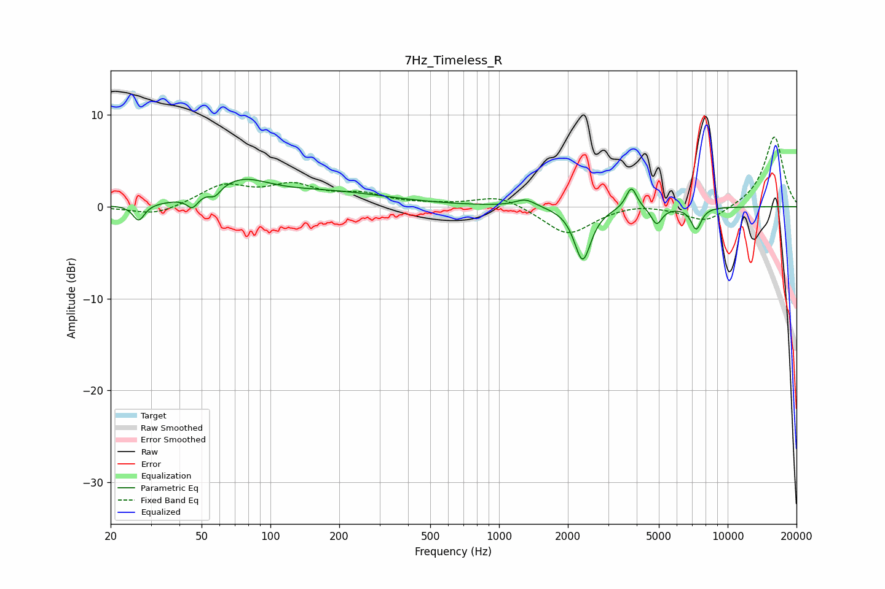

# 7Hz_Timeless_R
See [usage instructions](https://github.com/jaakkopasanen/AutoEq#usage) for more options and info.

### Parametric EQs
Apply preamp of -3.1 dB when using parametric equalizer.

|   # | Type    |   Fc (Hz) |    Q |   Gain (dB) |
|-----|---------|-----------|------|-------------|
|   1 | Peaking |        27 | 5.75 |        -1.8 |
|   2 | Peaking |        46 | 5.98 |        -1.3 |
|   3 | Peaking |        57 | 6    |        -0.9 |
|   4 | Peaking |        74 | 1.15 |         2.4 |
|   5 | Peaking |       182 | 0.54 |         1.4 |
|   6 | Peaking |      1306 | 3.16 |         0.9 |
|   7 | Peaking |      2321 | 3.91 |        -5.8 |
|   8 | Peaking |      3793 | 6    |         2.4 |
|   9 | Peaking |      4892 | 6    |        -1.9 |
|  10 | Peaking |      7283 | 6    |        -2.4 |

### Fixed Band EQs
When using fixed band (also called graphic) equalizer, apply preamp of **-7.7 dB** (if available) and set gains manually with these parameters.

|   # | Type    |   Fc (Hz) |    Q |   Gain (dB) |
|-----|---------|-----------|------|-------------|
|   1 | Peaking |        31 | 1.41 |        -1   |
|   2 | Peaking |        62 | 1.41 |         2.2 |
|   3 | Peaking |       125 | 1.41 |         2   |
|   4 | Peaking |       250 | 1.41 |         1.1 |
|   5 | Peaking |       500 | 1.41 |         0.1 |
|   6 | Peaking |      1000 | 1.41 |         1.3 |
|   7 | Peaking |      2000 | 1.41 |        -3.1 |
|   8 | Peaking |      4000 | 1.41 |         0.4 |
|   9 | Peaking |      8000 | 1.41 |        -1.8 |
|  10 | Peaking |     16000 | 1.41 |         7.7 |

### Graphs

