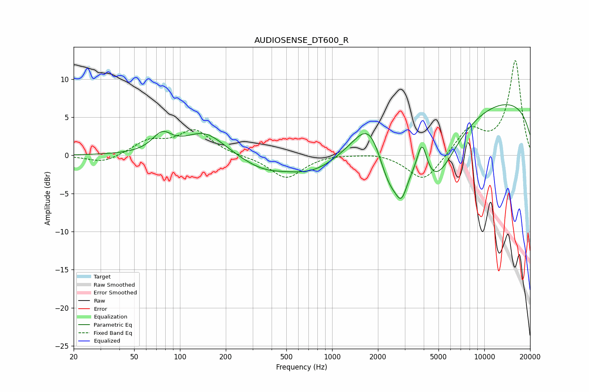

# AUDIOSENSE_DT600_R
See [usage instructions](https://github.com/jaakkopasanen/AutoEq#usage) for more options and info.

### Parametric EQs
Apply preamp of -6.8 dB when using parametric equalizer.

|   # | Type    |   Fc (Hz) |    Q |   Gain (dB) |
|-----|---------|-----------|------|-------------|
|   1 | Peaking |        76 | 2.24 |         2.3 |
|   2 | Peaking |       145 | 1.07 |         3.1 |
|   3 | Peaking |       351 | 0.94 |        -1.6 |
|   4 | Peaking |       752 | 0.77 |        -2.4 |
|   5 | Peaking |      1797 | 1.36 |         6.1 |
|   6 | Peaking |      2373 | 1.5  |        -7.4 |
|   7 | Peaking |      2859 | 3.9  |        -3   |
|   8 | Peaking |      3901 | 4.18 |         4.6 |
|   9 | Peaking |      4706 | 0.9  |        -9.1 |
|  10 | Peaking |     10000 | 0.18 |         7.8 |

### Fixed Band EQs
When using fixed band (also called graphic) equalizer, apply preamp of **-12.5 dB** (if available) and set gains manually with these parameters.

|   # | Type    |   Fc (Hz) |    Q |   Gain (dB) |
|-----|---------|-----------|------|-------------|
|   1 | Peaking |        31 | 1.41 |        -1.1 |
|   2 | Peaking |        62 | 1.41 |         1.8 |
|   3 | Peaking |       125 | 1.41 |         3.2 |
|   4 | Peaking |       250 | 1.41 |        -0.1 |
|   5 | Peaking |       500 | 1.41 |        -3   |
|   6 | Peaking |      1000 | 1.41 |         0.2 |
|   7 | Peaking |      2000 | 1.41 |         0.4 |
|   8 | Peaking |      4000 | 1.41 |        -3.6 |
|   9 | Peaking |      8000 | 1.41 |         3.4 |
|  10 | Peaking |     16000 | 1.41 |        12.4 |

### Graphs

