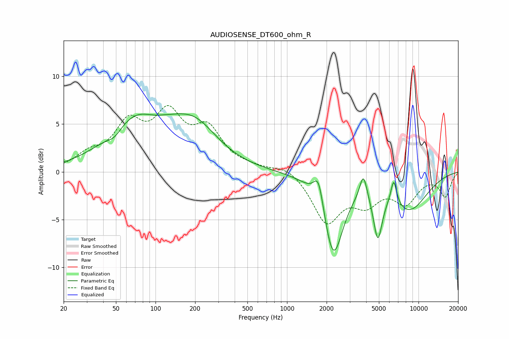

# AUDIOSENSE_DT600_ohm_R
See [usage instructions](https://github.com/jaakkopasanen/AutoEq#usage) for more options and info.

### Parametric EQs
Apply preamp of -6.2 dB when using parametric equalizer.

|   # | Type    |   Fc (Hz) |    Q |   Gain (dB) |
|-----|---------|-----------|------|-------------|
|   1 | Peaking |        49 | 2.57 |        -0.8 |
|   2 | Peaking |        77 | 0.62 |         5.9 |
|   3 | Peaking |        94 | 1.38 |        -0.9 |
|   4 | Peaking |       200 | 0.8  |         3.8 |
|   5 | Peaking |      1739 | 3.82 |         3.1 |
|   6 | Peaking |      2249 | 1.87 |        -8.6 |
|   7 | Peaking |      3807 | 5.22 |         2.6 |
|   8 | Peaking |      4901 | 4.15 |        -5.1 |
|   9 | Peaking |      6480 | 6    |         2.7 |
|  10 | Peaking |      8470 | 0.88 |        -3.8 |

### Fixed Band EQs
When using fixed band (also called graphic) equalizer, apply preamp of **-7.0 dB** (if available) and set gains manually with these parameters.

|   # | Type    |   Fc (Hz) |    Q |   Gain (dB) |
|-----|---------|-----------|------|-------------|
|   1 | Peaking |        31 | 1.41 |         1.5 |
|   2 | Peaking |        62 | 1.41 |         4.5 |
|   3 | Peaking |       125 | 1.41 |         5.3 |
|   4 | Peaking |       250 | 1.41 |         4   |
|   5 | Peaking |       500 | 1.41 |         0.3 |
|   6 | Peaking |      1000 | 1.41 |         0.8 |
|   7 | Peaking |      2000 | 1.41 |        -5.1 |
|   8 | Peaking |      4000 | 1.41 |        -2.7 |
|   9 | Peaking |      8000 | 1.41 |        -2.9 |
|  10 | Peaking |     16000 | 1.41 |        -2.5 |

### Graphs

