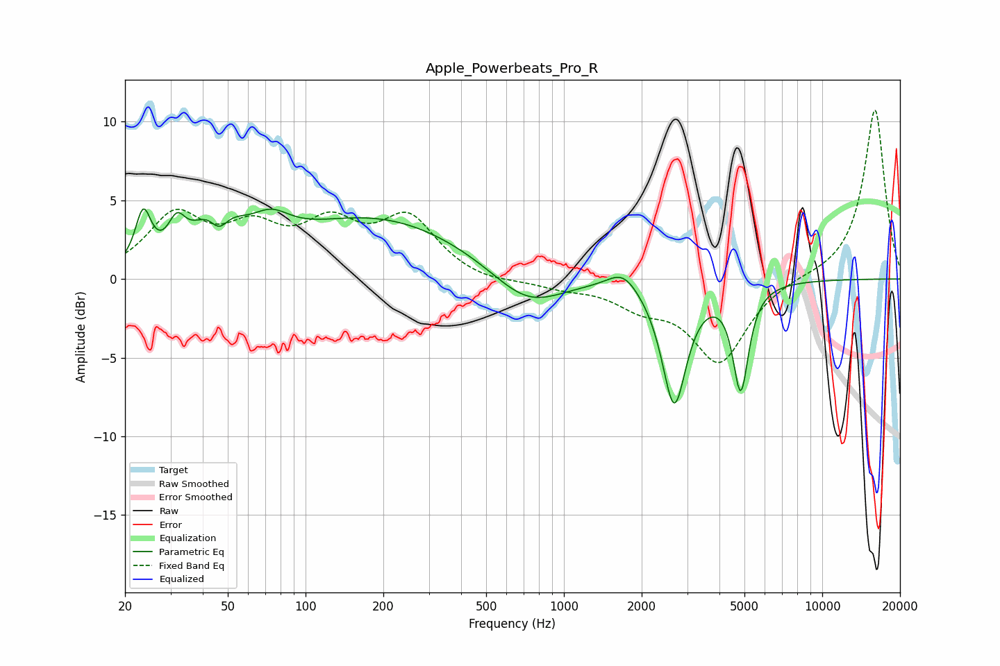

# Apple_Powerbeats_Pro_R
See [usage instructions](https://github.com/jaakkopasanen/AutoEq#usage) for more options and info.

### Parametric EQs
Apply preamp of -4.5 dB when using parametric equalizer.

|   # | Type    |   Fc (Hz) |    Q |   Gain (dB) |
|-----|---------|-----------|------|-------------|
|   1 | Peaking |        24 | 4.78 |         3.3 |
|   2 | Peaking |        32 | 4.28 |         1.9 |
|   3 | Peaking |        45 | 1.78 |         3.8 |
|   4 | Peaking |        46 | 3.62 |        -2.2 |
|   5 | Peaking |        73 | 1.91 |         1.5 |
|   6 | Peaking |       189 | 0.4  |         3.8 |
|   7 | Peaking |       723 | 1.02 |        -2.3 |
|   8 | Peaking |      1694 | 2.38 |         1.2 |
|   9 | Peaking |      2673 | 2.97 |        -7.8 |
|  10 | Peaking |      4836 | 4.62 |        -6.6 |

### Fixed Band EQs
When using fixed band (also called graphic) equalizer, apply preamp of **-10.8 dB** (if available) and set gains manually with these parameters.

|   # | Type    |   Fc (Hz) |    Q |   Gain (dB) |
|-----|---------|-----------|------|-------------|
|   1 | Peaking |        31 | 1.41 |         3.8 |
|   2 | Peaking |        62 | 1.41 |         2.6 |
|   3 | Peaking |       125 | 1.41 |         3   |
|   4 | Peaking |       250 | 1.41 |         3.6 |
|   5 | Peaking |       500 | 1.41 |        -0.3 |
|   6 | Peaking |      1000 | 1.41 |        -0.5 |
|   7 | Peaking |      2000 | 1.41 |        -1.4 |
|   8 | Peaking |      4000 | 1.41 |        -5.2 |
|   9 | Peaking |      8000 | 1.41 |         0.1 |
|  10 | Peaking |     16000 | 1.41 |        10.8 |

### Graphs

