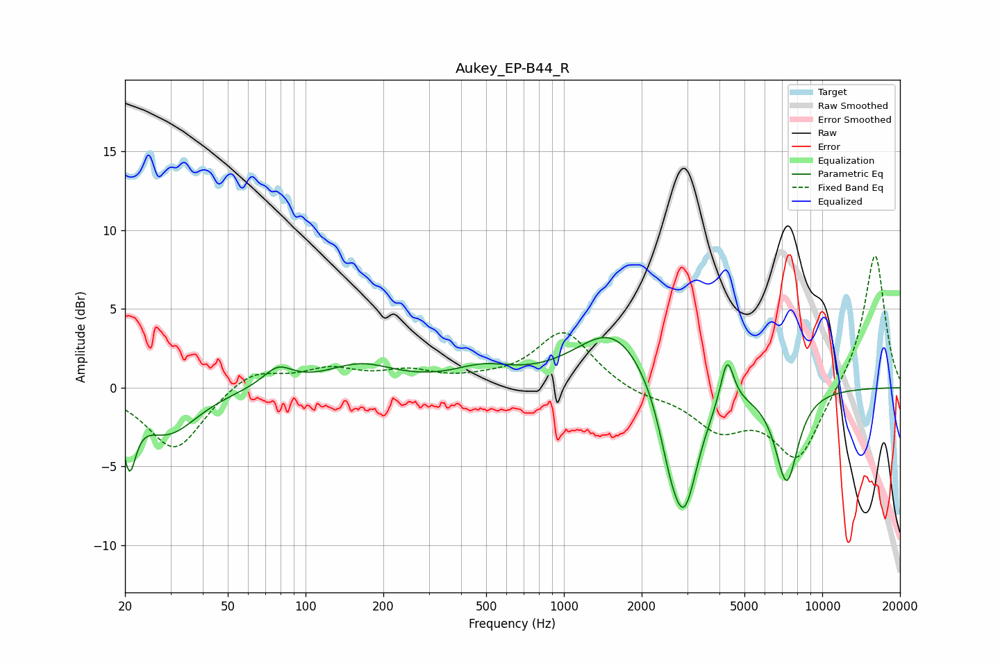

# Aukey_EP-B44_R
See [usage instructions](https://github.com/jaakkopasanen/AutoEq#usage) for more options and info.

### Parametric EQs
Apply preamp of -3.3 dB when using parametric equalizer.

|   # | Type    |   Fc (Hz) |    Q |   Gain (dB) |
|-----|---------|-----------|------|-------------|
|   1 | Peaking |        21 | 5.79 |        -3.8 |
|   2 | Peaking |        29 | 1.27 |        -2.8 |
|   3 | Peaking |        78 | 2.46 |         1.2 |
|   4 | Peaking |       163 | 1.07 |         1.4 |
|   5 | Peaking |       486 | 1.23 |         1   |
|   6 | Peaking |      1560 | 0.97 |         3.9 |
|   7 | Peaking |      2559 | 3.2  |        -2.1 |
|   8 | Peaking |      2918 | 2.48 |        -7.8 |
|   9 | Peaking |      4284 | 5.47 |         3   |
|  10 | Peaking |      7282 | 3.01 |        -5.8 |

### Fixed Band EQs
When using fixed band (also called graphic) equalizer, apply preamp of **-8.5 dB** (if available) and set gains manually with these parameters.

|   # | Type    |   Fc (Hz) |    Q |   Gain (dB) |
|-----|---------|-----------|------|-------------|
|   1 | Peaking |        31 | 1.41 |        -4   |
|   2 | Peaking |        62 | 1.41 |         1.2 |
|   3 | Peaking |       125 | 1.41 |         1.1 |
|   4 | Peaking |       250 | 1.41 |         0.9 |
|   5 | Peaking |       500 | 1.41 |         0.3 |
|   6 | Peaking |      1000 | 1.41 |         3.6 |
|   7 | Peaking |      2000 | 1.41 |        -0.5 |
|   8 | Peaking |      4000 | 1.41 |        -2.4 |
|   9 | Peaking |      8000 | 1.41 |        -4.5 |
|  10 | Peaking |     16000 | 1.41 |         8.7 |

### Graphs

