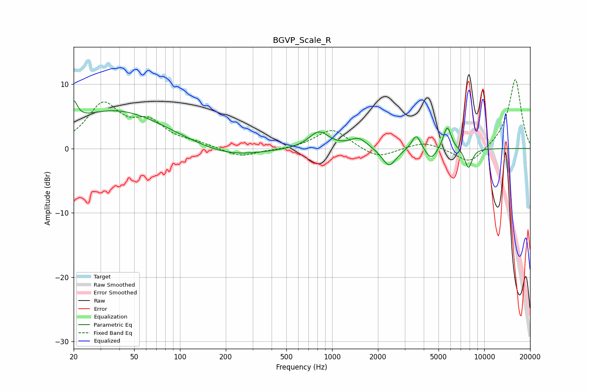

# BGVP_Scale_R
See [usage instructions](https://github.com/jaakkopasanen/AutoEq#usage) for more options and info.

### Parametric EQs
Apply preamp of -7.5 dB when using parametric equalizer.

|   # | Type    |   Fc (Hz) |    Q |   Gain (dB) |
|-----|---------|-----------|------|-------------|
|   1 | Peaking |        20 | 5.95 |         3.1 |
|   2 | Peaking |        38 | 0.43 |         5.9 |
|   3 | Peaking |       206 | 0.65 |        -1.6 |
|   4 | Peaking |       818 | 2.16 |         2.6 |
|   5 | Peaking |      1491 | 2.51 |         1.6 |
|   6 | Peaking |      2366 | 3.03 |        -2.9 |
|   7 | Peaking |      3577 | 4.67 |         2.5 |
|   8 | Peaking |      4473 | 3.58 |        -1.9 |
|   9 | Peaking |      5710 | 5.25 |         3.7 |
|  10 | Peaking |      7861 | 5.39 |        -3.1 |

### Fixed Band EQs
When using fixed band (also called graphic) equalizer, apply preamp of **-10.8 dB** (if available) and set gains manually with these parameters.

|   # | Type    |   Fc (Hz) |    Q |   Gain (dB) |
|-----|---------|-----------|------|-------------|
|   1 | Peaking |        31 | 1.41 |         6.6 |
|   2 | Peaking |        62 | 1.41 |         3.5 |
|   3 | Peaking |       125 | 1.41 |         0.6 |
|   4 | Peaking |       250 | 1.41 |        -1.4 |
|   5 | Peaking |       500 | 1.41 |        -0.2 |
|   6 | Peaking |      1000 | 1.41 |         3.1 |
|   7 | Peaking |      2000 | 1.41 |        -1.7 |
|   8 | Peaking |      4000 | 1.41 |         1.1 |
|   9 | Peaking |      8000 | 1.41 |        -2.6 |
|  10 | Peaking |     16000 | 1.41 |        10.9 |

### Graphs

