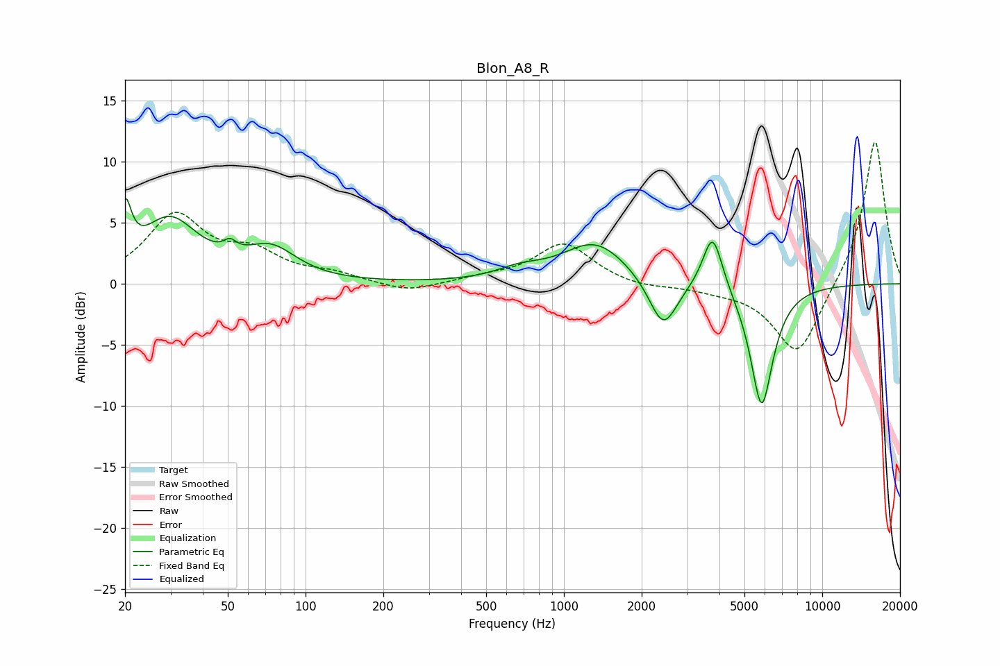

# Blon_A8_R
See [usage instructions](https://github.com/jaakkopasanen/AutoEq#usage) for more options and info.

### Parametric EQs
Apply preamp of -7.1 dB when using parametric equalizer.

|   # | Type    |   Fc (Hz) |    Q |   Gain (dB) |
|-----|---------|-----------|------|-------------|
|   1 | Peaking |        20 | 5.99 |         4.5 |
|   2 | Peaking |        30 | 1.29 |         5   |
|   3 | Peaking |        51 | 5.85 |         3.2 |
|   4 | Peaking |        52 | 6    |        -2.3 |
|   5 | Peaking |        73 | 1.43 |         2.5 |
|   6 | Peaking |       673 | 1.56 |         0.8 |
|   7 | Peaking |      1325 | 1.11 |         3.4 |
|   8 | Peaking |      2424 | 2.57 |        -4.2 |
|   9 | Peaking |      3764 | 3.69 |         4.8 |
|  10 | Peaking |      5829 | 3.11 |       -10.1 |

### Fixed Band EQs
When using fixed band (also called graphic) equalizer, apply preamp of **-11.7 dB** (if available) and set gains manually with these parameters.

|   # | Type    |   Fc (Hz) |    Q |   Gain (dB) |
|-----|---------|-----------|------|-------------|
|   1 | Peaking |        31 | 1.41 |         5.4 |
|   2 | Peaking |        62 | 1.41 |         2.1 |
|   3 | Peaking |       125 | 1.41 |         0.7 |
|   4 | Peaking |       250 | 1.41 |        -0.8 |
|   5 | Peaking |       500 | 1.41 |         0.4 |
|   6 | Peaking |      1000 | 1.41 |         3.3 |
|   7 | Peaking |      2000 | 1.41 |        -0.4 |
|   8 | Peaking |      4000 | 1.41 |        -0.4 |
|   9 | Peaking |      8000 | 1.41 |        -6   |
|  10 | Peaking |     16000 | 1.41 |        12   |

### Graphs

