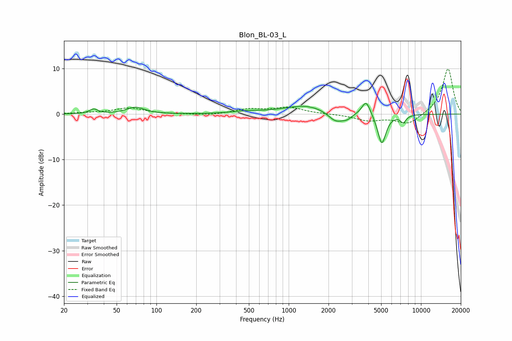

# Blon_BL-03_L
See [usage instructions](https://github.com/jaakkopasanen/AutoEq#usage) for more options and info.

### Parametric EQs
Apply preamp of -2.4 dB when using parametric equalizer.

|   # | Type    |   Fc (Hz) |    Q |   Gain (dB) |
|-----|---------|-----------|------|-------------|
|   1 | Peaking |        34 | 4.67 |         1   |
|   2 | Peaking |        70 | 2.16 |         1.5 |
|   3 | Peaking |       479 | 1.33 |         0.5 |
|   4 | Peaking |      1361 | 0.86 |         2   |
|   5 | Peaking |      2268 | 2.39 |        -2.3 |
|   6 | Peaking |      2761 | 3.75 |        -0.9 |
|   7 | Peaking |      3849 | 4.28 |         3.3 |
|   8 | Peaking |      5057 | 4.4  |        -6.7 |
|   9 | Peaking |      7343 | 6    |        -1.6 |
|  10 | Peaking |      8399 | 6    |        -0   |

### Fixed Band EQs
When using fixed band (also called graphic) equalizer, apply preamp of **-10.0 dB** (if available) and set gains manually with these parameters.

|   # | Type    |   Fc (Hz) |    Q |   Gain (dB) |
|-----|---------|-----------|------|-------------|
|   1 | Peaking |        31 | 1.41 |         0.2 |
|   2 | Peaking |        62 | 1.41 |         1.3 |
|   3 | Peaking |       125 | 1.41 |        -0   |
|   4 | Peaking |       250 | 1.41 |        -0.3 |
|   5 | Peaking |       500 | 1.41 |         1   |
|   6 | Peaking |      1000 | 1.41 |         1.4 |
|   7 | Peaking |      2000 | 1.41 |         0   |
|   8 | Peaking |      4000 | 1.41 |        -1.4 |
|   9 | Peaking |      8000 | 1.41 |        -2.3 |
|  10 | Peaking |     16000 | 1.41 |        10.1 |

### Graphs

