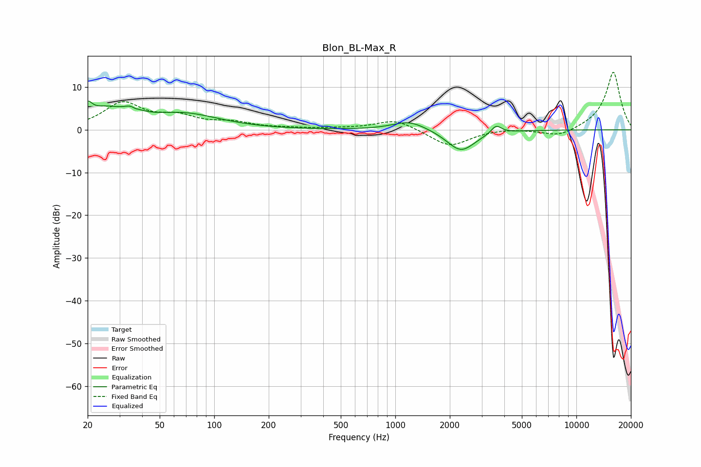

# Blon_BL-Max_R
See [usage instructions](https://github.com/jaakkopasanen/AutoEq#usage) for more options and info.

### Parametric EQs
Apply preamp of -6.8 dB when using parametric equalizer.

|   # | Type    |   Fc (Hz) |    Q |   Gain (dB) |
|-----|---------|-----------|------|-------------|
|   1 | Peaking |        20 | 5.9  |         3   |
|   2 | Peaking |        25 | 1.36 |         3.9 |
|   3 | Peaking |        35 | 2.96 |         1.8 |
|   4 | Peaking |        36 | 5.96 |         2.4 |
|   5 | Peaking |        36 | 5.98 |        -2.8 |
|   6 | Peaking |        68 | 0.71 |         3.6 |
|   7 | Peaking |      1175 | 1.65 |         1.7 |
|   8 | Peaking |      1334 | 1.2  |         0.6 |
|   9 | Peaking |      2303 | 1.79 |        -5.1 |
|  10 | Peaking |      3608 | 5.04 |         2   |

### Fixed Band EQs
When using fixed band (also called graphic) equalizer, apply preamp of **-13.6 dB** (if available) and set gains manually with these parameters.

|   # | Type    |   Fc (Hz) |    Q |   Gain (dB) |
|-----|---------|-----------|------|-------------|
|   1 | Peaking |        31 | 1.41 |         6   |
|   2 | Peaking |        62 | 1.41 |         2.6 |
|   3 | Peaking |       125 | 1.41 |         1.5 |
|   4 | Peaking |       250 | 1.41 |         0.3 |
|   5 | Peaking |       500 | 1.41 |         0.2 |
|   6 | Peaking |      1000 | 1.41 |         2.5 |
|   7 | Peaking |      2000 | 1.41 |        -4   |
|   8 | Peaking |      4000 | 1.41 |         0.4 |
|   9 | Peaking |      8000 | 1.41 |        -1.8 |
|  10 | Peaking |     16000 | 1.41 |        13.7 |

### Graphs

