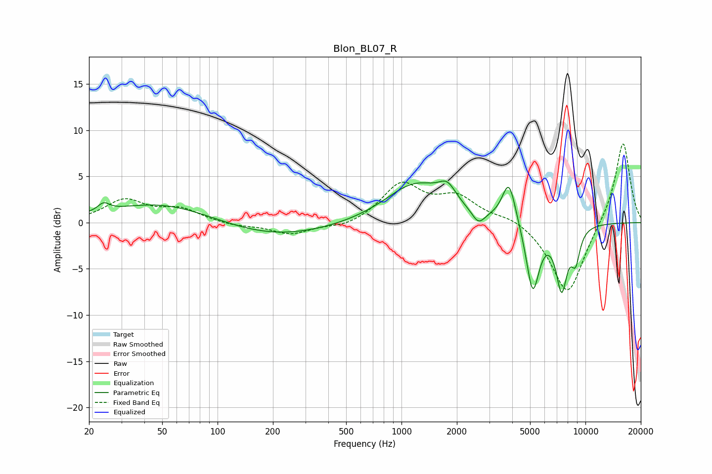

# Blon_BL07_R
See [usage instructions](https://github.com/jaakkopasanen/AutoEq#usage) for more options and info.

### Parametric EQs
Apply preamp of -4.6 dB when using parametric equalizer.

|   # | Type    |   Fc (Hz) |    Q |   Gain (dB) |
|-----|---------|-----------|------|-------------|
|   1 | Peaking |        24 | 4.55 |         0.9 |
|   2 | Peaking |        51 | 0.49 |         2.3 |
|   3 | Peaking |       196 | 0.45 |        -1.7 |
|   4 | Peaking |      1198 | 0.86 |         4.2 |
|   5 | Peaking |      1775 | 3.04 |         1.8 |
|   6 | Peaking |      2620 | 3.97 |        -1.5 |
|   7 | Peaking |      3841 | 3.8  |         4.6 |
|   8 | Peaking |      5171 | 3.83 |        -7.5 |
|   9 | Peaking |      7424 | 4.25 |        -6.6 |
|  10 | Peaking |      8842 | 5.34 |        -3.2 |

### Fixed Band EQs
When using fixed band (also called graphic) equalizer, apply preamp of **-8.6 dB** (if available) and set gains manually with these parameters.

|   # | Type    |   Fc (Hz) |    Q |   Gain (dB) |
|-----|---------|-----------|------|-------------|
|   1 | Peaking |        31 | 1.41 |         2.4 |
|   2 | Peaking |        62 | 1.41 |         1.4 |
|   3 | Peaking |       125 | 1.41 |        -0.4 |
|   4 | Peaking |       250 | 1.41 |        -1.3 |
|   5 | Peaking |       500 | 1.41 |        -0.6 |
|   6 | Peaking |      1000 | 1.41 |         4.1 |
|   7 | Peaking |      2000 | 1.41 |         2.5 |
|   8 | Peaking |      4000 | 1.41 |         0.7 |
|   9 | Peaking |      8000 | 1.41 |        -8   |
|  10 | Peaking |     16000 | 1.41 |         9   |

### Graphs

