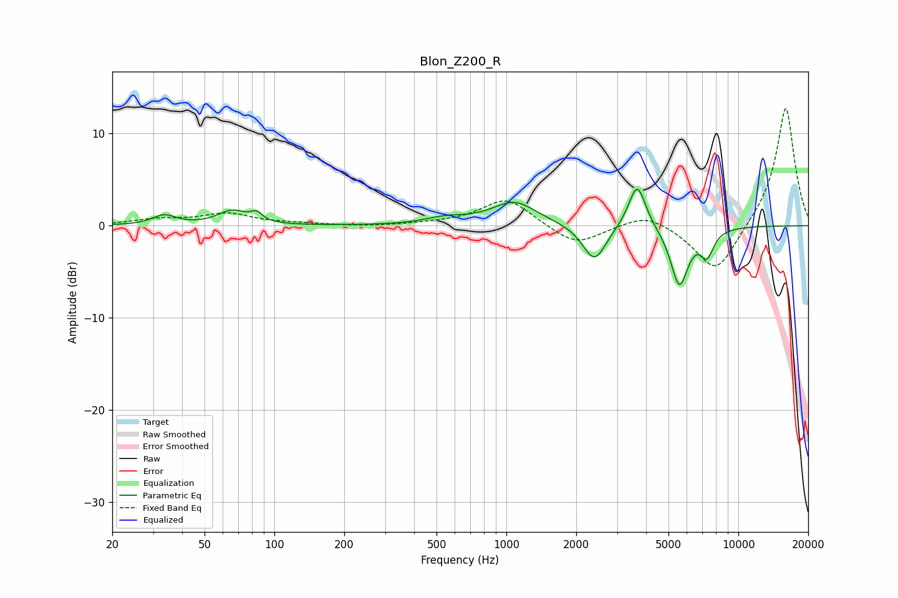

# Blon_Z200_R
See [usage instructions](https://github.com/jaakkopasanen/AutoEq#usage) for more options and info.

### Parametric EQs
Apply preamp of -4.1 dB when using parametric equalizer.

|   # | Type    |   Fc (Hz) |    Q |   Gain (dB) |
|-----|---------|-----------|------|-------------|
|   1 | Peaking |        33 | 2.88 |         1.1 |
|   2 | Peaking |        66 | 2.31 |         1.5 |
|   3 | Peaking |        84 | 5.77 |         0.9 |
|   4 | Peaking |       548 | 1.62 |         0.7 |
|   5 | Peaking |      1082 | 1.47 |         2.6 |
|   6 | Peaking |      2375 | 2.46 |        -0.7 |
|   7 | Peaking |      2399 | 2.9  |        -3.3 |
|   8 | Peaking |      3663 | 3.79 |         5   |
|   9 | Peaking |      5570 | 3.64 |        -6.4 |
|  10 | Peaking |      7333 | 4.68 |        -2.7 |

### Fixed Band EQs
When using fixed band (also called graphic) equalizer, apply preamp of **-12.8 dB** (if available) and set gains manually with these parameters.

|   # | Type    |   Fc (Hz) |    Q |   Gain (dB) |
|-----|---------|-----------|------|-------------|
|   1 | Peaking |        31 | 1.41 |         0.6 |
|   2 | Peaking |        62 | 1.41 |         1.3 |
|   3 | Peaking |       125 | 1.41 |         0.2 |
|   4 | Peaking |       250 | 1.41 |        -0.1 |
|   5 | Peaking |       500 | 1.41 |         0.2 |
|   6 | Peaking |      1000 | 1.41 |         3   |
|   7 | Peaking |      2000 | 1.41 |        -2.2 |
|   8 | Peaking |      4000 | 1.41 |         1.5 |
|   9 | Peaking |      8000 | 1.41 |        -5.4 |
|  10 | Peaking |     16000 | 1.41 |        13.1 |

### Graphs

