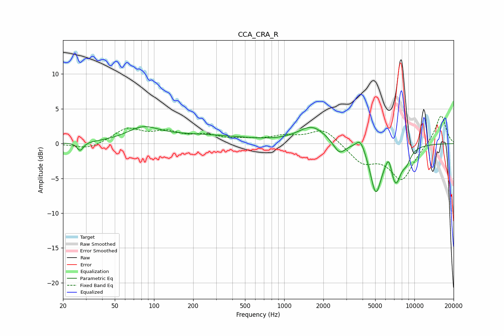

# CCA_CRA_R
See [usage instructions](https://github.com/jaakkopasanen/AutoEq#usage) for more options and info.

### Parametric EQs
Apply preamp of -2.5 dB when using parametric equalizer.

|   # | Type    |   Fc (Hz) |    Q |   Gain (dB) |
|-----|---------|-----------|------|-------------|
|   1 | Peaking |        27 | 5.98 |        -1.2 |
|   2 | Peaking |        82 | 1.17 |         1.8 |
|   3 | Peaking |       227 | 0.41 |         1.1 |
|   4 | Peaking |      1640 | 1.33 |         2.4 |
|   5 | Peaking |      2657 | 3.08 |        -1.8 |
|   6 | Peaking |      3857 | 4    |         1.7 |
|   7 | Peaking |      5053 | 3.19 |        -6.7 |
|   8 | Peaking |      6354 | 6    |         1.9 |
|   9 | Peaking |      7182 | 3.22 |        -4.9 |
|  10 | Peaking |      8693 | 3.66 |        -1.6 |

### Fixed Band EQs
When using fixed band (also called graphic) equalizer, apply preamp of **-4.1 dB** (if available) and set gains manually with these parameters.

|   # | Type    |   Fc (Hz) |    Q |   Gain (dB) |
|-----|---------|-----------|------|-------------|
|   1 | Peaking |        31 | 1.41 |        -0.9 |
|   2 | Peaking |        62 | 1.41 |         2.1 |
|   3 | Peaking |       125 | 1.41 |         1.4 |
|   4 | Peaking |       250 | 1.41 |         1   |
|   5 | Peaking |       500 | 1.41 |         0.4 |
|   6 | Peaking |      1000 | 1.41 |         0.9 |
|   7 | Peaking |      2000 | 1.41 |         2.2 |
|   8 | Peaking |      4000 | 1.41 |        -2.6 |
|   9 | Peaking |      8000 | 1.41 |        -5.1 |
|  10 | Peaking |     16000 | 1.41 |         4.2 |

### Graphs

