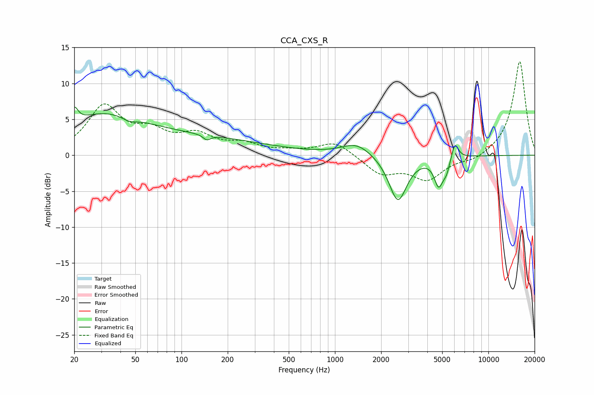

# CCA_CXS_R
See [usage instructions](https://github.com/jaakkopasanen/AutoEq#usage) for more options and info.

### Parametric EQs
Apply preamp of -6.8 dB when using parametric equalizer.

|   # | Type    |   Fc (Hz) |    Q |   Gain (dB) |
|-----|---------|-----------|------|-------------|
|   1 | Peaking |        20 | 5.94 |         2.2 |
|   2 | Peaking |        29 | 0.56 |         4.6 |
|   3 | Peaking |        46 | 2.98 |        -0.6 |
|   4 | Peaking |       113 | 0.28 |         2.3 |
|   5 | Peaking |       146 | 5.98 |        -0.7 |
|   6 | Peaking |      1384 | 1.46 |         1.7 |
|   7 | Peaking |      2571 | 2.41 |        -6.5 |
|   8 | Peaking |      4743 | 4.81 |        -3.7 |
|   9 | Peaking |      5332 | 5.97 |        -1.6 |
|  10 | Peaking |      6046 | 5.93 |         2.4 |

### Fixed Band EQs
When using fixed band (also called graphic) equalizer, apply preamp of **-13.1 dB** (if available) and set gains manually with these parameters.

|   # | Type    |   Fc (Hz) |    Q |   Gain (dB) |
|-----|---------|-----------|------|-------------|
|   1 | Peaking |        31 | 1.41 |         6.6 |
|   2 | Peaking |        62 | 1.41 |         2.6 |
|   3 | Peaking |       125 | 1.41 |         2.5 |
|   4 | Peaking |       250 | 1.41 |         1.3 |
|   5 | Peaking |       500 | 1.41 |         0.4 |
|   6 | Peaking |      1000 | 1.41 |         1.9 |
|   7 | Peaking |      2000 | 1.41 |        -2.5 |
|   8 | Peaking |      4000 | 1.41 |        -3.2 |
|   9 | Peaking |      8000 | 1.41 |        -0.8 |
|  10 | Peaking |     16000 | 1.41 |        13.2 |

### Graphs

