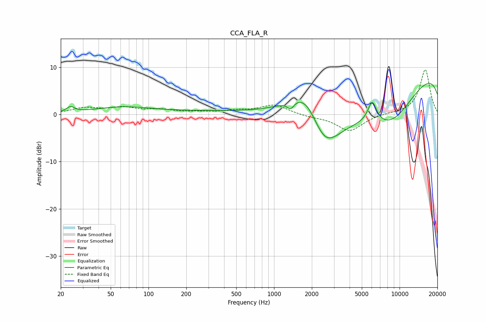

# CCA_FLA_R
See [usage instructions](https://github.com/jaakkopasanen/AutoEq#usage) for more options and info.

### Parametric EQs
Apply preamp of -6.7 dB when using parametric equalizer.

|   # | Type    |   Fc (Hz) |    Q |   Gain (dB) |
|-----|---------|-----------|------|-------------|
|   1 | Peaking |        24 | 4.47 |         1.2 |
|   2 | Peaking |        27 | 3.58 |        -0.1 |
|   3 | Peaking |        62 | 0.61 |         1.4 |
|   4 | Peaking |       477 | 0.23 |         0.7 |
|   5 | Peaking |      1355 | 5.3  |        -1.6 |
|   6 | Peaking |      1818 | 0.89 |        10.2 |
|   7 | Peaking |      2500 | 0.73 |       -16.3 |
|   8 | Peaking |      6055 | 3.82 |         4.6 |
|   9 | Peaking |      8494 | 0.47 |       -13   |
|  10 | Peaking |     10000 | 0.18 |        13.8 |

### Fixed Band EQs
When using fixed band (also called graphic) equalizer, apply preamp of **-9.5 dB** (if available) and set gains manually with these parameters.

|   # | Type    |   Fc (Hz) |    Q |   Gain (dB) |
|-----|---------|-----------|------|-------------|
|   1 | Peaking |        31 | 1.41 |         1.3 |
|   2 | Peaking |        62 | 1.41 |         1.3 |
|   3 | Peaking |       125 | 1.41 |         0.8 |
|   4 | Peaking |       250 | 1.41 |         0.4 |
|   5 | Peaking |       500 | 1.41 |         0.6 |
|   6 | Peaking |      1000 | 1.41 |         2   |
|   7 | Peaking |      2000 | 1.41 |        -0.4 |
|   8 | Peaking |      4000 | 1.41 |        -3.5 |
|   9 | Peaking |      8000 | 1.41 |         0.2 |
|  10 | Peaking |     16000 | 1.41 |         9.5 |

### Graphs

