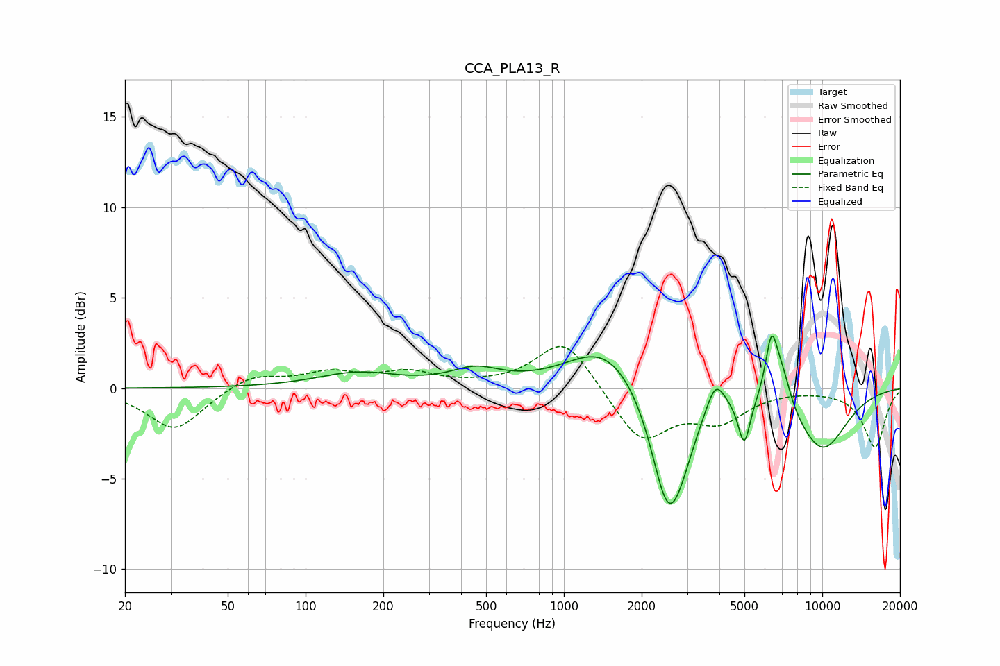

# CCA_PLA13_R
See [usage instructions](https://github.com/jaakkopasanen/AutoEq#usage) for more options and info.

### Parametric EQs
Apply preamp of -3.0 dB when using parametric equalizer.

|   # | Type    |   Fc (Hz) |    Q |   Gain (dB) |
|-----|---------|-----------|------|-------------|
|   1 | Peaking |       159 | 0.92 |         0.8 |
|   2 | Peaking |       455 | 1.47 |         0.9 |
|   3 | Peaking |      1452 | 0.98 |         2.5 |
|   4 | Peaking |      2526 | 2.16 |        -6.4 |
|   5 | Peaking |      2843 | 2.34 |        -1.4 |
|   6 | Peaking |      3859 | 3.94 |         1.7 |
|   7 | Peaking |      4991 | 5.95 |        -2.6 |
|   8 | Peaking |      6366 | 5.69 |         3.4 |
|   9 | Peaking |      7003 | 3.82 |         1.7 |
|  10 | Peaking |     10000 | 1.18 |        -3.4 |

### Fixed Band EQs
When using fixed band (also called graphic) equalizer, apply preamp of **-2.4 dB** (if available) and set gains manually with these parameters.

|   # | Type    |   Fc (Hz) |    Q |   Gain (dB) |
|-----|---------|-----------|------|-------------|
|   1 | Peaking |        31 | 1.41 |        -2.3 |
|   2 | Peaking |        62 | 1.41 |         0.8 |
|   3 | Peaking |       125 | 1.41 |         0.8 |
|   4 | Peaking |       250 | 1.41 |         0.8 |
|   5 | Peaking |       500 | 1.41 |         0.1 |
|   6 | Peaking |      1000 | 1.41 |         2.8 |
|   7 | Peaking |      2000 | 1.41 |        -2.9 |
|   8 | Peaking |      4000 | 1.41 |        -1.6 |
|   9 | Peaking |      8000 | 1.41 |         0   |
|  10 | Peaking |     16000 | 1.41 |        -3.2 |

### Graphs

