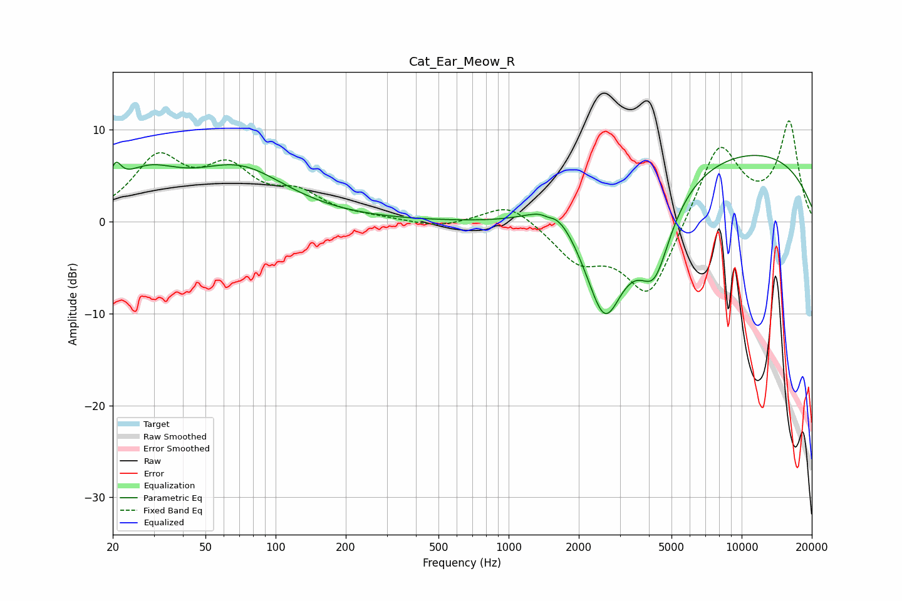

# Cat_Ear_Meow_R
See [usage instructions](https://github.com/jaakkopasanen/AutoEq#usage) for more options and info.

### Parametric EQs
Apply preamp of -7.3 dB when using parametric equalizer.

|   # | Type    |   Fc (Hz) |    Q |   Gain (dB) |
|-----|---------|-----------|------|-------------|
|   1 | Peaking |        21 | 6    |         2.4 |
|   2 | Peaking |        28 | 1.02 |         4.2 |
|   3 | Peaking |        70 | 0.7  |         5.3 |
|   4 | Peaking |      1478 | 5.87 |        -0.4 |
|   5 | Peaking |      1622 | 1.23 |         4.8 |
|   6 | Peaking |      2311 | 1.56 |         2.6 |
|   7 | Peaking |      2424 | 0.91 |       -12.2 |
|   8 | Peaking |      2592 | 2.12 |        -6.1 |
|   9 | Peaking |      4232 | 1.99 |        -7.7 |
|  10 | Peaking |      8435 | 0.22 |         8.3 |

### Fixed Band EQs
When using fixed band (also called graphic) equalizer, apply preamp of **-11.0 dB** (if available) and set gains manually with these parameters.

|   # | Type    |   Fc (Hz) |    Q |   Gain (dB) |
|-----|---------|-----------|------|-------------|
|   1 | Peaking |        31 | 1.41 |         6.4 |
|   2 | Peaking |        62 | 1.41 |         5   |
|   3 | Peaking |       125 | 1.41 |         2.5 |
|   4 | Peaking |       250 | 1.41 |         0.3 |
|   5 | Peaking |       500 | 1.41 |        -0.7 |
|   6 | Peaking |      1000 | 1.41 |         2.3 |
|   7 | Peaking |      2000 | 1.41 |        -3.9 |
|   8 | Peaking |      4000 | 1.41 |        -8.4 |
|   9 | Peaking |      8000 | 1.41 |         8.8 |
|  10 | Peaking |     16000 | 1.41 |        10.6 |

### Graphs

