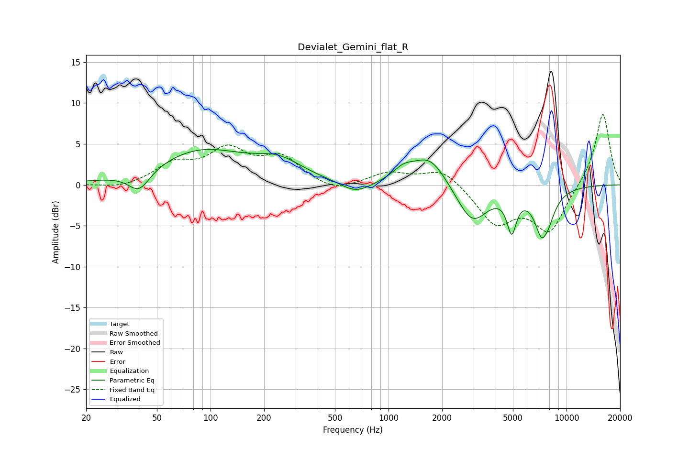

# Devialet_Gemini_flat_R
See [usage instructions](https://github.com/jaakkopasanen/AutoEq#usage) for more options and info.

### Parametric EQs
Apply preamp of -4.4 dB when using parametric equalizer.

|   # | Type    |   Fc (Hz) |    Q |   Gain (dB) |
|-----|---------|-----------|------|-------------|
|   1 | Peaking |        40 | 2.32 |        -2.6 |
|   2 | Peaking |        89 | 0.55 |         4.1 |
|   3 | Peaking |       243 | 1.05 |         2.1 |
|   4 | Peaking |       654 | 1.67 |        -1.4 |
|   5 | Peaking |      1213 | 2.36 |         1.3 |
|   6 | Peaking |      1704 | 1.48 |         3.6 |
|   7 | Peaking |      2951 | 1.61 |        -4.7 |
|   8 | Peaking |      4921 | 5.33 |        -4.4 |
|   9 | Peaking |      7453 | 3.11 |        -7.7 |
|  10 | Peaking |      7539 | 6    |         1.8 |

### Fixed Band EQs
When using fixed band (also called graphic) equalizer, apply preamp of **-8.7 dB** (if available) and set gains manually with these parameters.

|   # | Type    |   Fc (Hz) |    Q |   Gain (dB) |
|-----|---------|-----------|------|-------------|
|   1 | Peaking |        31 | 1.41 |        -0.5 |
|   2 | Peaking |        62 | 1.41 |         2.3 |
|   3 | Peaking |       125 | 1.41 |         3.9 |
|   4 | Peaking |       250 | 1.41 |         3.1 |
|   5 | Peaking |       500 | 1.41 |        -1.1 |
|   6 | Peaking |      1000 | 1.41 |         1.4 |
|   7 | Peaking |      2000 | 1.41 |         2.1 |
|   8 | Peaking |      4000 | 1.41 |        -4.6 |
|   9 | Peaking |      8000 | 1.41 |        -5.6 |
|  10 | Peaking |     16000 | 1.41 |         9   |

### Graphs

