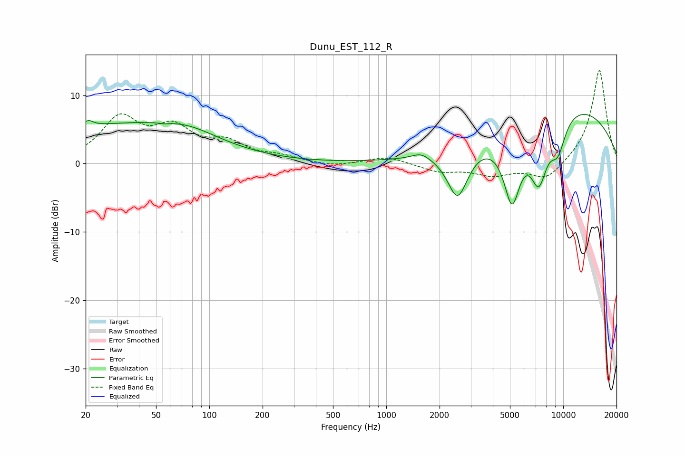

# Dunu_EST_112_R
See [usage instructions](https://github.com/jaakkopasanen/AutoEq#usage) for more options and info.

### Parametric EQs
Apply preamp of -7.3 dB when using parametric equalizer.

|   # | Type    |   Fc (Hz) |    Q |   Gain (dB) |
|-----|---------|-----------|------|-------------|
|   1 | Peaking |        21 | 4.94 |         1   |
|   2 | Peaking |        32 | 0.29 |         5.6 |
|   3 | Peaking |        56 | 5.6  |        -0.2 |
|   4 | Peaking |        76 | 0.93 |         1.3 |
|   5 | Peaking |      1573 | 2.89 |         0.9 |
|   6 | Peaking |      2533 | 2.34 |        -7.5 |
|   7 | Peaking |      5136 | 2.75 |       -10.6 |
|   8 | Peaking |      7277 | 2.63 |        -8.5 |
|   9 | Peaking |      9330 | 2.78 |        -4.9 |
|  10 | Peaking |      9825 | 0.29 |         9   |

### Fixed Band EQs
When using fixed band (also called graphic) equalizer, apply preamp of **-13.7 dB** (if available) and set gains manually with these parameters.

|   # | Type    |   Fc (Hz) |    Q |   Gain (dB) |
|-----|---------|-----------|------|-------------|
|   1 | Peaking |        31 | 1.41 |         6.3 |
|   2 | Peaking |        62 | 1.41 |         4.5 |
|   3 | Peaking |       125 | 1.41 |         2.6 |
|   4 | Peaking |       250 | 1.41 |         0.9 |
|   5 | Peaking |       500 | 1.41 |        -0.5 |
|   6 | Peaking |      1000 | 1.41 |         1.1 |
|   7 | Peaking |      2000 | 1.41 |        -1.1 |
|   8 | Peaking |      4000 | 1.41 |        -1.6 |
|   9 | Peaking |      8000 | 1.41 |        -2.5 |
|  10 | Peaking |     16000 | 1.41 |        13.9 |

### Graphs

