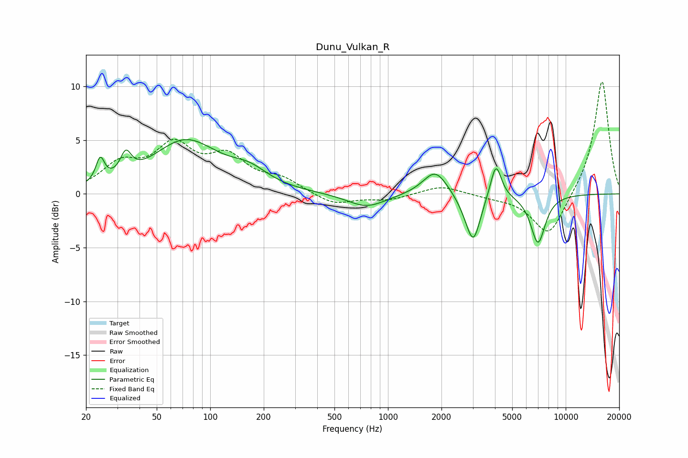

# Dunu_Vulkan_R
See [usage instructions](https://github.com/jaakkopasanen/AutoEq#usage) for more options and info.

### Parametric EQs
Apply preamp of -5.1 dB when using parametric equalizer.

|   # | Type    |   Fc (Hz) |    Q |   Gain (dB) |
|-----|---------|-----------|------|-------------|
|   1 | Peaking |        24 | 6    |         2.2 |
|   2 | Peaking |        33 | 4.63 |         2.1 |
|   3 | Peaking |        73 | 0.75 |         4.8 |
|   4 | Peaking |       166 | 1.36 |         1.3 |
|   5 | Peaking |       757 | 1.29 |        -1.3 |
|   6 | Peaking |      1849 | 2.04 |         2.4 |
|   7 | Peaking |      2822 | 2.48 |        -1.1 |
|   8 | Peaking |      3031 | 3.7  |        -3.7 |
|   9 | Peaking |      4049 | 4.6  |         3.3 |
|  10 | Peaking |      6985 | 3.28 |        -4.5 |

### Fixed Band EQs
When using fixed band (also called graphic) equalizer, apply preamp of **-10.5 dB** (if available) and set gains manually with these parameters.

|   # | Type    |   Fc (Hz) |    Q |   Gain (dB) |
|-----|---------|-----------|------|-------------|
|   1 | Peaking |        31 | 1.41 |         2.5 |
|   2 | Peaking |        62 | 1.41 |         4   |
|   3 | Peaking |       125 | 1.41 |         3   |
|   4 | Peaking |       250 | 1.41 |         1.2 |
|   5 | Peaking |       500 | 1.41 |        -1   |
|   6 | Peaking |      1000 | 1.41 |        -0.5 |
|   7 | Peaking |      2000 | 1.41 |         0.8 |
|   8 | Peaking |      4000 | 1.41 |        -0.3 |
|   9 | Peaking |      8000 | 1.41 |        -4.1 |
|  10 | Peaking |     16000 | 1.41 |        10.7 |

### Graphs

