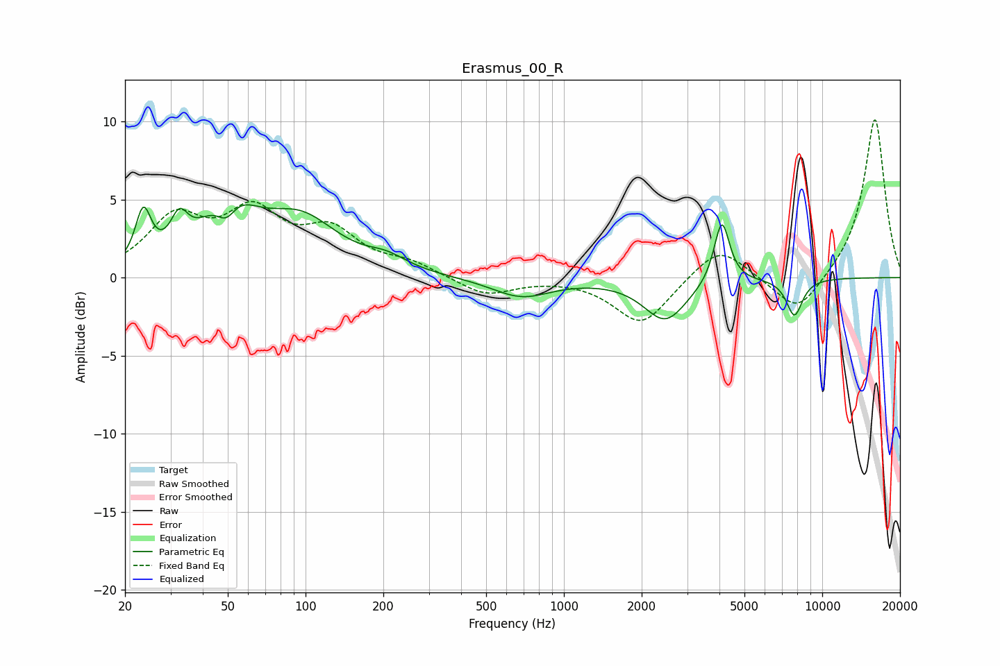

# Erasmus_00_R
See [usage instructions](https://github.com/jaakkopasanen/AutoEq#usage) for more options and info.

### Parametric EQs
Apply preamp of -4.8 dB when using parametric equalizer.

|   # | Type    |   Fc (Hz) |    Q |   Gain (dB) |
|-----|---------|-----------|------|-------------|
|   1 | Peaking |        24 | 4.73 |         3.4 |
|   2 | Peaking |        32 | 4.21 |         2.1 |
|   3 | Peaking |        49 | 3.45 |        -2   |
|   4 | Peaking |        50 | 1.44 |         4.5 |
|   5 | Peaking |        96 | 0.97 |         3.4 |
|   6 | Peaking |       206 | 1.81 |         0.7 |
|   7 | Peaking |       684 | 1.23 |        -1.2 |
|   8 | Peaking |      2472 | 1.69 |        -2.7 |
|   9 | Peaking |      4086 | 4.73 |         4.1 |
|  10 | Peaking |      7804 | 4.24 |        -2.4 |

### Fixed Band EQs
When using fixed band (also called graphic) equalizer, apply preamp of **-10.2 dB** (if available) and set gains manually with these parameters.

|   # | Type    |   Fc (Hz) |    Q |   Gain (dB) |
|-----|---------|-----------|------|-------------|
|   1 | Peaking |        31 | 1.41 |         3.5 |
|   2 | Peaking |        62 | 1.41 |         3.7 |
|   3 | Peaking |       125 | 1.41 |         2.6 |
|   4 | Peaking |       250 | 1.41 |         0.8 |
|   5 | Peaking |       500 | 1.41 |        -1.2 |
|   6 | Peaking |      1000 | 1.41 |         0   |
|   7 | Peaking |      2000 | 1.41 |        -3   |
|   8 | Peaking |      4000 | 1.41 |         2.2 |
|   9 | Peaking |      8000 | 1.41 |        -2.5 |
|  10 | Peaking |     16000 | 1.41 |        10.3 |

### Graphs

