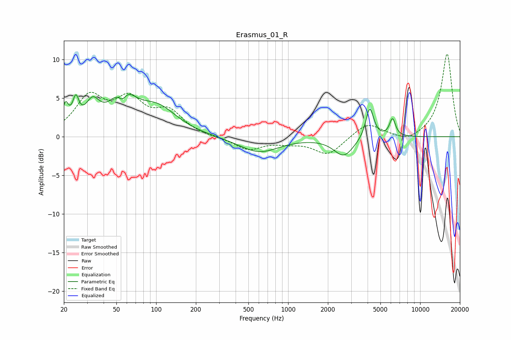

# Erasmus_01_R
See [usage instructions](https://github.com/jaakkopasanen/AutoEq#usage) for more options and info.

### Parametric EQs
Apply preamp of -5.6 dB when using parametric equalizer.

|   # | Type    |   Fc (Hz) |    Q |   Gain (dB) |
|-----|---------|-----------|------|-------------|
|   1 | Peaking |        21 | 5.95 |         3   |
|   2 | Peaking |        25 | 5.91 |         3.2 |
|   3 | Peaking |        33 | 2.56 |         3.3 |
|   4 | Peaking |        55 | 4.09 |        -2.2 |
|   5 | Peaking |        56 | 1.73 |         5.3 |
|   6 | Peaking |       102 | 0.93 |         3.5 |
|   7 | Peaking |       601 | 0.93 |        -2   |
|   8 | Peaking |      2640 | 1.88 |        -2.4 |
|   9 | Peaking |      4152 | 4.74 |         4.1 |
|  10 | Peaking |      6173 | 6    |         2.3 |

### Fixed Band EQs
When using fixed band (also called graphic) equalizer, apply preamp of **-10.8 dB** (if available) and set gains manually with these parameters.

|   # | Type    |   Fc (Hz) |    Q |   Gain (dB) |
|-----|---------|-----------|------|-------------|
|   1 | Peaking |        31 | 1.41 |         4.8 |
|   2 | Peaking |        62 | 1.41 |         4.2 |
|   3 | Peaking |       125 | 1.41 |         2.9 |
|   4 | Peaking |       250 | 1.41 |        -0.1 |
|   5 | Peaking |       500 | 1.41 |        -1.6 |
|   6 | Peaking |      1000 | 1.41 |        -0.6 |
|   7 | Peaking |      2000 | 1.41 |        -2.3 |
|   8 | Peaking |      4000 | 1.41 |         1.8 |
|   9 | Peaking |      8000 | 1.41 |        -0.8 |
|  10 | Peaking |     16000 | 1.41 |        10.8 |

### Graphs

