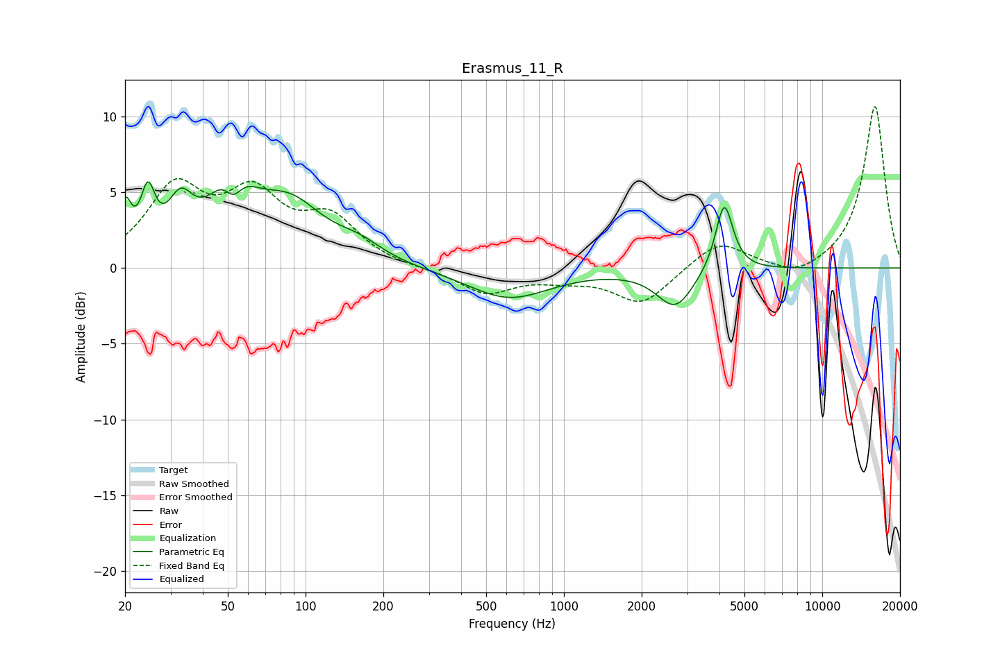

# Erasmus_11_R
See [usage instructions](https://github.com/jaakkopasanen/AutoEq#usage) for more options and info.

### Parametric EQs
Apply preamp of -5.8 dB when using parametric equalizer.

|   # | Type    |   Fc (Hz) |    Q |   Gain (dB) |
|-----|---------|-----------|------|-------------|
|   1 | Peaking |        20 | 5.91 |         3.2 |
|   2 | Peaking |        25 | 5.19 |         3.6 |
|   3 | Peaking |        33 | 2.85 |         3.1 |
|   4 | Peaking |        52 | 1.82 |         5.3 |
|   5 | Peaking |        53 | 3.76 |        -2.5 |
|   6 | Peaking |        87 | 1.07 |         3.7 |
|   7 | Peaking |       161 | 1.54 |         1   |
|   8 | Peaking |       611 | 0.89 |        -2   |
|   9 | Peaking |      2698 | 2    |        -2.6 |
|  10 | Peaking |      4174 | 4.19 |         4.6 |

### Fixed Band EQs
When using fixed band (also called graphic) equalizer, apply preamp of **-10.7 dB** (if available) and set gains manually with these parameters.

|   # | Type    |   Fc (Hz) |    Q |   Gain (dB) |
|-----|---------|-----------|------|-------------|
|   1 | Peaking |        31 | 1.41 |         5   |
|   2 | Peaking |        62 | 1.41 |         4.3 |
|   3 | Peaking |       125 | 1.41 |         2.9 |
|   4 | Peaking |       250 | 1.41 |        -0.1 |
|   5 | Peaking |       500 | 1.41 |        -1.7 |
|   6 | Peaking |      1000 | 1.41 |        -0.5 |
|   7 | Peaking |      2000 | 1.41 |        -2.4 |
|   8 | Peaking |      4000 | 1.41 |         1.8 |
|   9 | Peaking |      8000 | 1.41 |        -0.8 |
|  10 | Peaking |     16000 | 1.41 |        10.7 |

### Graphs

