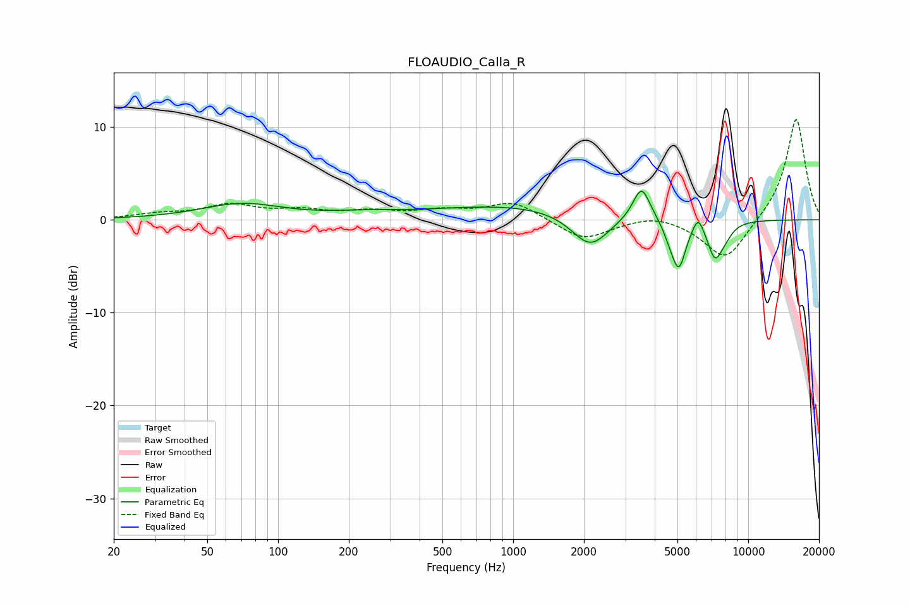

# FLOAUDIO_Calla_R
See [usage instructions](https://github.com/jaakkopasanen/AutoEq#usage) for more options and info.

### Parametric EQs
Apply preamp of -3.2 dB when using parametric equalizer.

|   # | Type    |   Fc (Hz) |    Q |   Gain (dB) |
|-----|---------|-----------|------|-------------|
|   1 | Peaking |        70 | 0.82 |         1.7 |
|   2 | Peaking |       235 | 0.95 |         0.5 |
|   3 | Peaking |      1059 | 0.39 |         1.6 |
|   4 | Peaking |      2125 | 1.75 |        -3.7 |
|   5 | Peaking |      3516 | 3.83 |         3.7 |
|   6 | Peaking |      4622 | 5.74 |        -0.9 |
|   7 | Peaking |      5064 | 4.59 |        -5   |
|   8 | Peaking |      6127 | 5.97 |         1.8 |
|   9 | Peaking |      7223 | 4.15 |        -3.8 |
|  10 | Peaking |      8007 | 4.12 |        -0.9 |

### Fixed Band EQs
When using fixed band (also called graphic) equalizer, apply preamp of **-10.9 dB** (if available) and set gains manually with these parameters.

|   # | Type    |   Fc (Hz) |    Q |   Gain (dB) |
|-----|---------|-----------|------|-------------|
|   1 | Peaking |        31 | 1.41 |         0.5 |
|   2 | Peaking |        62 | 1.41 |         1.5 |
|   3 | Peaking |       125 | 1.41 |         0.8 |
|   4 | Peaking |       250 | 1.41 |         0.8 |
|   5 | Peaking |       500 | 1.41 |         0.8 |
|   6 | Peaking |      1000 | 1.41 |         1.9 |
|   7 | Peaking |      2000 | 1.41 |        -2.2 |
|   8 | Peaking |      4000 | 1.41 |         0.7 |
|   9 | Peaking |      8000 | 1.41 |        -4.5 |
|  10 | Peaking |     16000 | 1.41 |        11.1 |

### Graphs

