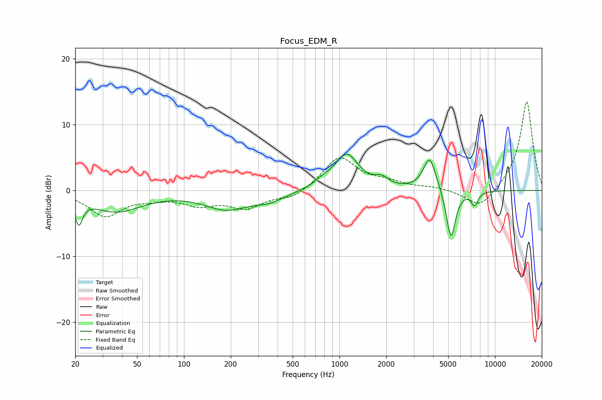

# Focus_EDM_R
See [usage instructions](https://github.com/jaakkopasanen/AutoEq#usage) for more options and info.

### Parametric EQs
Apply preamp of -5.6 dB when using parametric equalizer.

|   # | Type    |   Fc (Hz) |    Q |   Gain (dB) |
|-----|---------|-----------|------|-------------|
|   1 | Peaking |        21 | 5.91 |        -3.7 |
|   2 | Peaking |        37 | 0.86 |        -3.1 |
|   3 | Peaking |       188 | 0.97 |        -2.7 |
|   4 | Peaking |       357 | 1.51 |        -1.2 |
|   5 | Peaking |       777 | 2.88 |         0.7 |
|   6 | Peaking |      1109 | 1.81 |         5.4 |
|   7 | Peaking |      1869 | 3.28 |         1.2 |
|   8 | Peaking |      3802 | 3.45 |         5.1 |
|   9 | Peaking |      5210 | 4.75 |        -7.7 |
|  10 | Peaking |      7389 | 6    |        -2   |

### Fixed Band EQs
When using fixed band (also called graphic) equalizer, apply preamp of **-13.6 dB** (if available) and set gains manually with these parameters.

|   # | Type    |   Fc (Hz) |    Q |   Gain (dB) |
|-----|---------|-----------|------|-------------|
|   1 | Peaking |        31 | 1.41 |        -3.8 |
|   2 | Peaking |        62 | 1.41 |        -0.8 |
|   3 | Peaking |       125 | 1.41 |        -1.9 |
|   4 | Peaking |       250 | 1.41 |        -2.5 |
|   5 | Peaking |       500 | 1.41 |        -1.2 |
|   6 | Peaking |      1000 | 1.41 |         5.1 |
|   7 | Peaking |      2000 | 1.41 |         1   |
|   8 | Peaking |      4000 | 1.41 |         0.4 |
|   9 | Peaking |      8000 | 1.41 |        -2.9 |
|  10 | Peaking |     16000 | 1.41 |        13.7 |

### Graphs

