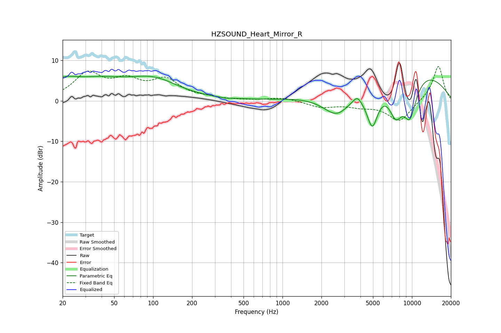

# HZSOUND_Heart_Mirror_R
See [usage instructions](https://github.com/jaakkopasanen/AutoEq#usage) for more options and info.

### Parametric EQs
Apply preamp of -6.2 dB when using parametric equalizer.

|   # | Type    |   Fc (Hz) |    Q |   Gain (dB) |
|-----|---------|-----------|------|-------------|
|   1 | Peaking |        20 | 1.24 |         3.4 |
|   2 | Peaking |        39 | 0.67 |         4   |
|   3 | Peaking |       101 | 0.74 |         4.6 |
|   4 | Peaking |       365 | 4.96 |        -0.2 |
|   5 | Peaking |      2649 | 1.21 |        -7.1 |
|   6 | Peaking |      3777 | 4.96 |         1.4 |
|   7 | Peaking |      4941 | 2.79 |       -10.7 |
|   8 | Peaking |      7488 | 2.15 |        -9.1 |
|   9 | Peaking |      8047 | 0.32 |        10.4 |
|  10 | Peaking |      9648 | 2.07 |       -10.7 |

### Fixed Band EQs
When using fixed band (also called graphic) equalizer, apply preamp of **-8.6 dB** (if available) and set gains manually with these parameters.

|   # | Type    |   Fc (Hz) |    Q |   Gain (dB) |
|-----|---------|-----------|------|-------------|
|   1 | Peaking |        31 | 1.41 |         6.4 |
|   2 | Peaking |        62 | 1.41 |         4.1 |
|   3 | Peaking |       125 | 1.41 |         4.7 |
|   4 | Peaking |       250 | 1.41 |         0.5 |
|   5 | Peaking |       500 | 1.41 |         0.1 |
|   6 | Peaking |      1000 | 1.41 |         0.8 |
|   7 | Peaking |      2000 | 1.41 |        -1.5 |
|   8 | Peaking |      4000 | 1.41 |        -1.1 |
|   9 | Peaking |      8000 | 1.41 |        -5.1 |
|  10 | Peaking |     16000 | 1.41 |         8.8 |

### Graphs

