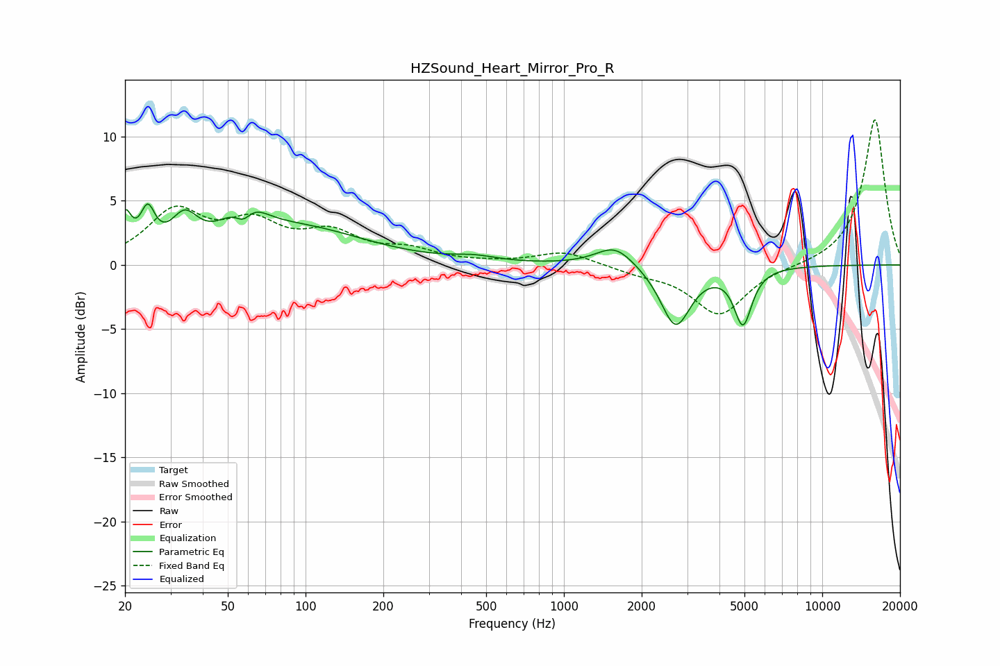

# HZSound_Heart_Mirror_Pro_R
See [usage instructions](https://github.com/jaakkopasanen/AutoEq#usage) for more options and info.

### Parametric EQs
Apply preamp of -4.8 dB when using parametric equalizer.

|   # | Type    |   Fc (Hz) |    Q |   Gain (dB) |
|-----|---------|-----------|------|-------------|
|   1 | Peaking |        20 | 5.89 |         3   |
|   2 | Peaking |        24 | 5.06 |         3   |
|   3 | Peaking |        34 | 2.77 |         2.6 |
|   4 | Peaking |        57 | 3.79 |        -2.4 |
|   5 | Peaking |        58 | 2.2  |         3.7 |
|   6 | Peaking |        95 | 0.55 |         2.7 |
|   7 | Peaking |       451 | 1.7  |         0.4 |
|   8 | Peaking |      1577 | 1.92 |         1.7 |
|   9 | Peaking |      2706 | 2.45 |        -4.8 |
|  10 | Peaking |      4933 | 4.1  |        -4.3 |

### Fixed Band EQs
When using fixed band (also called graphic) equalizer, apply preamp of **-11.4 dB** (if available) and set gains manually with these parameters.

|   # | Type    |   Fc (Hz) |    Q |   Gain (dB) |
|-----|---------|-----------|------|-------------|
|   1 | Peaking |        31 | 1.41 |         4   |
|   2 | Peaking |        62 | 1.41 |         2.8 |
|   3 | Peaking |       125 | 1.41 |         2.1 |
|   4 | Peaking |       250 | 1.41 |         1   |
|   5 | Peaking |       500 | 1.41 |         0.1 |
|   6 | Peaking |      1000 | 1.41 |         1   |
|   7 | Peaking |      2000 | 1.41 |        -0.5 |
|   8 | Peaking |      4000 | 1.41 |        -3.9 |
|   9 | Peaking |      8000 | 1.41 |        -0.1 |
|  10 | Peaking |     16000 | 1.41 |        11.4 |

### Graphs

