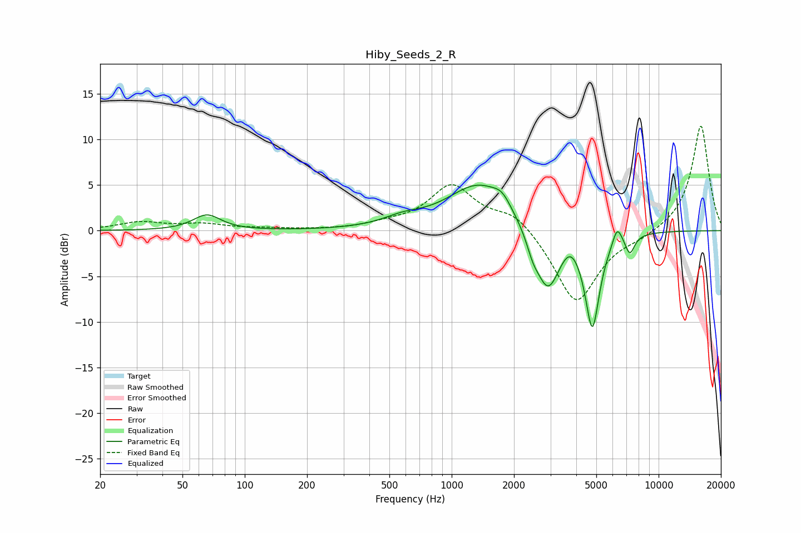

# Hiby_Seeds_2_R
See [usage instructions](https://github.com/jaakkopasanen/AutoEq#usage) for more options and info.

### Parametric EQs
Apply preamp of -5.1 dB when using parametric equalizer.

|   # | Type    |   Fc (Hz) |    Q |   Gain (dB) |
|-----|---------|-----------|------|-------------|
|   1 | Peaking |        66 | 2.14 |         1.7 |
|   2 | Peaking |       581 | 1.48 |         0.8 |
|   3 | Peaking |      1365 | 0.92 |         5.2 |
|   4 | Peaking |      1754 | 3.42 |         1.1 |
|   5 | Peaking |      2466 | 4.72 |        -1.4 |
|   6 | Peaking |      2915 | 2.31 |        -7   |
|   7 | Peaking |      3731 | 3.35 |         1.3 |
|   8 | Peaking |      4783 | 3.92 |       -10.5 |
|   9 | Peaking |      6308 | 5.95 |         2   |
|  10 | Peaking |      7264 | 6    |        -2   |

### Fixed Band EQs
When using fixed band (also called graphic) equalizer, apply preamp of **-11.6 dB** (if available) and set gains manually with these parameters.

|   # | Type    |   Fc (Hz) |    Q |   Gain (dB) |
|-----|---------|-----------|------|-------------|
|   1 | Peaking |        31 | 1.41 |         0.9 |
|   2 | Peaking |        62 | 1.41 |         0.6 |
|   3 | Peaking |       125 | 1.41 |         0.2 |
|   4 | Peaking |       250 | 1.41 |         0   |
|   5 | Peaking |       500 | 1.41 |         0.5 |
|   6 | Peaking |      1000 | 1.41 |         4.8 |
|   7 | Peaking |      2000 | 1.41 |         2.1 |
|   8 | Peaking |      4000 | 1.41 |        -8.1 |
|   9 | Peaking |      8000 | 1.41 |        -0.6 |
|  10 | Peaking |     16000 | 1.41 |        11.6 |

### Graphs

