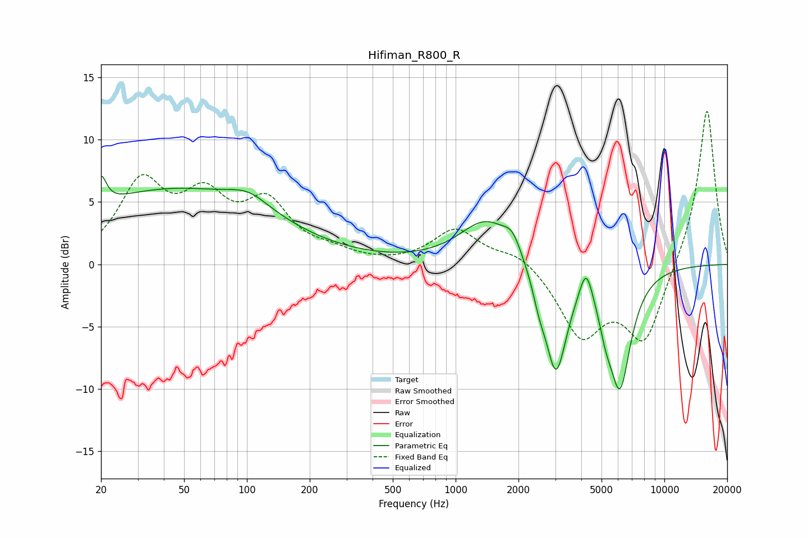

# Hifiman_R800_R
See [usage instructions](https://github.com/jaakkopasanen/AutoEq#usage) for more options and info.

### Parametric EQs
Apply preamp of -7.2 dB when using parametric equalizer.

|   # | Type    |   Fc (Hz) |    Q |   Gain (dB) |
|-----|---------|-----------|------|-------------|
|   1 | Peaking |        20 | 5.62 |         2.3 |
|   2 | Peaking |        44 | 0.28 |         5.9 |
|   3 | Peaking |       102 | 1.44 |         1.2 |
|   4 | Peaking |      1411 | 1.1  |         3.6 |
|   5 | Peaking |      1871 | 3.47 |         1.4 |
|   6 | Peaking |      2510 | 4.76 |        -1.4 |
|   7 | Peaking |      3023 | 2.67 |        -8.7 |
|   8 | Peaking |      4217 | 4.53 |         2.7 |
|   9 | Peaking |      5235 | 4.23 |        -1.8 |
|  10 | Peaking |      6128 | 2.57 |        -9.3 |

### Fixed Band EQs
When using fixed band (also called graphic) equalizer, apply preamp of **-12.4 dB** (if available) and set gains manually with these parameters.

|   # | Type    |   Fc (Hz) |    Q |   Gain (dB) |
|-----|---------|-----------|------|-------------|
|   1 | Peaking |        31 | 1.41 |         6.2 |
|   2 | Peaking |        62 | 1.41 |         4.5 |
|   3 | Peaking |       125 | 1.41 |         4.4 |
|   4 | Peaking |       250 | 1.41 |         0.7 |
|   5 | Peaking |       500 | 1.41 |        -0   |
|   6 | Peaking |      1000 | 1.41 |         2.8 |
|   7 | Peaking |      2000 | 1.41 |         1.1 |
|   8 | Peaking |      4000 | 1.41 |        -5.5 |
|   9 | Peaking |      8000 | 1.41 |        -6.1 |
|  10 | Peaking |     16000 | 1.41 |        12.7 |

### Graphs

