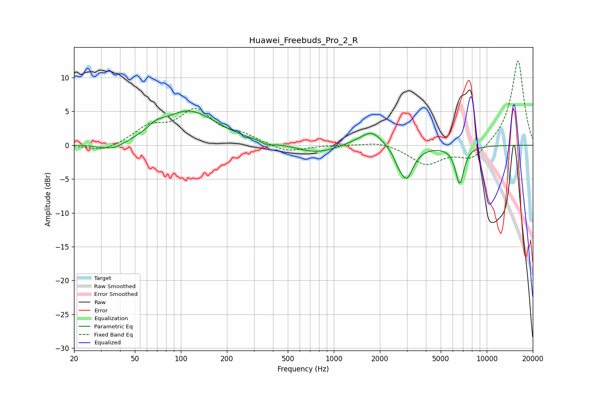

# Huawei_Freebuds_Pro_2_R
See [usage instructions](https://github.com/jaakkopasanen/AutoEq#usage) for more options and info.

### Parametric EQs
Apply preamp of -5.1 dB when using parametric equalizer.

|   # | Type    |   Fc (Hz) |    Q |   Gain (dB) |
|-----|---------|-----------|------|-------------|
|   1 | Peaking |        36 | 1.52 |        -1.3 |
|   2 | Peaking |        69 | 2.97 |         0.8 |
|   3 | Peaking |       112 | 0.77 |         5.1 |
|   4 | Peaking |       367 | 4.08 |        -0.5 |
|   5 | Peaking |       771 | 1.12 |        -1.2 |
|   6 | Peaking |      1430 | 1.59 |         0.5 |
|   7 | Peaking |      1780 | 2.13 |         2.1 |
|   8 | Peaking |      2623 | 5.43 |        -0.9 |
|   9 | Peaking |      2981 | 3.14 |        -4.8 |
|  10 | Peaking |      6655 | 4.82 |        -5.5 |

### Fixed Band EQs
When using fixed band (also called graphic) equalizer, apply preamp of **-12.6 dB** (if available) and set gains manually with these parameters.

|   # | Type    |   Fc (Hz) |    Q |   Gain (dB) |
|-----|---------|-----------|------|-------------|
|   1 | Peaking |        31 | 1.41 |        -1   |
|   2 | Peaking |        62 | 1.41 |         2.4 |
|   3 | Peaking |       125 | 1.41 |         4.9 |
|   4 | Peaking |       250 | 1.41 |         1.2 |
|   5 | Peaking |       500 | 1.41 |        -1.1 |
|   6 | Peaking |      1000 | 1.41 |         0   |
|   7 | Peaking |      2000 | 1.41 |         0.6 |
|   8 | Peaking |      4000 | 1.41 |        -2.8 |
|   9 | Peaking |      8000 | 1.41 |        -2.2 |
|  10 | Peaking |     16000 | 1.41 |        12.7 |

### Graphs

