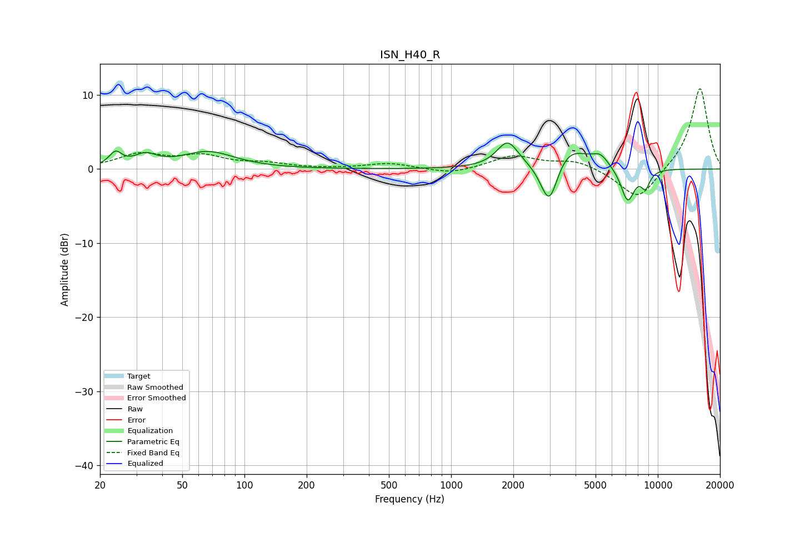

# ISN_H40_R
See [usage instructions](https://github.com/jaakkopasanen/AutoEq#usage) for more options and info.

### Parametric EQs
Apply preamp of -3.6 dB when using parametric equalizer.

|   # | Type    |   Fc (Hz) |    Q |   Gain (dB) |
|-----|---------|-----------|------|-------------|
|   1 | Peaking |        24 | 4.67 |         1.8 |
|   2 | Peaking |        33 | 2.66 |         1.5 |
|   3 | Peaking |        67 | 1.11 |         2.3 |
|   4 | Peaking |      1876 | 2.73 |         3.5 |
|   5 | Peaking |      2980 | 2.83 |        -1.5 |
|   6 | Peaking |      2987 | 3.41 |        -5   |
|   7 | Peaking |      3648 | 1.48 |         3.4 |
|   8 | Peaking |      5278 | 3.51 |         1.4 |
|   9 | Peaking |      7149 | 4.04 |        -4.6 |
|  10 | Peaking |      8723 | 5.97 |        -2.2 |

### Fixed Band EQs
When using fixed band (also called graphic) equalizer, apply preamp of **-11.0 dB** (if available) and set gains manually with these parameters.

|   # | Type    |   Fc (Hz) |    Q |   Gain (dB) |
|-----|---------|-----------|------|-------------|
|   1 | Peaking |        31 | 1.41 |         1.9 |
|   2 | Peaking |        62 | 1.41 |         1.6 |
|   3 | Peaking |       125 | 1.41 |         0.7 |
|   4 | Peaking |       250 | 1.41 |         0   |
|   5 | Peaking |       500 | 1.41 |         0.8 |
|   6 | Peaking |      1000 | 1.41 |        -0.7 |
|   7 | Peaking |      2000 | 1.41 |         1.8 |
|   8 | Peaking |      4000 | 1.41 |         1.1 |
|   9 | Peaking |      8000 | 1.41 |        -4.3 |
|  10 | Peaking |     16000 | 1.41 |        11.1 |

### Graphs

