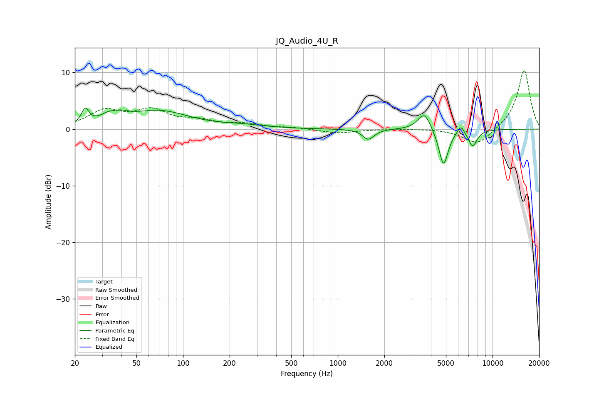

# JQ_Audio_4U_R
See [usage instructions](https://github.com/jaakkopasanen/AutoEq#usage) for more options and info.

### Parametric EQs
Apply preamp of -3.8 dB when using parametric equalizer.

|   # | Type    |   Fc (Hz) |    Q |   Gain (dB) |
|-----|---------|-----------|------|-------------|
|   1 | Peaking |        23 | 5.9  |         2.6 |
|   2 | Peaking |        36 | 2.5  |         3.6 |
|   3 | Peaking |        36 | 3.58 |        -1.9 |
|   4 | Peaking |        70 | 0.74 |         3.1 |
|   5 | Peaking |       244 | 1.01 |         0.5 |
|   6 | Peaking |      1576 | 3.92 |        -1.8 |
|   7 | Peaking |      3626 | 3.43 |         3.2 |
|   8 | Peaking |      4824 | 4.54 |        -6.6 |
|   9 | Peaking |      6242 | 6    |         1.6 |
|  10 | Peaking |      7442 | 4.63 |        -2.9 |

### Fixed Band EQs
When using fixed band (also called graphic) equalizer, apply preamp of **-10.4 dB** (if available) and set gains manually with these parameters.

|   # | Type    |   Fc (Hz) |    Q |   Gain (dB) |
|-----|---------|-----------|------|-------------|
|   1 | Peaking |        31 | 1.41 |         3   |
|   2 | Peaking |        62 | 1.41 |         3   |
|   3 | Peaking |       125 | 1.41 |         1.2 |
|   4 | Peaking |       250 | 1.41 |         0.8 |
|   5 | Peaking |       500 | 1.41 |         0.2 |
|   6 | Peaking |      1000 | 1.41 |        -0.7 |
|   7 | Peaking |      2000 | 1.41 |         0   |
|   8 | Peaking |      4000 | 1.41 |         0.1 |
|   9 | Peaking |      8000 | 1.41 |        -2.9 |
|  10 | Peaking |     16000 | 1.41 |        10.6 |

### Graphs

