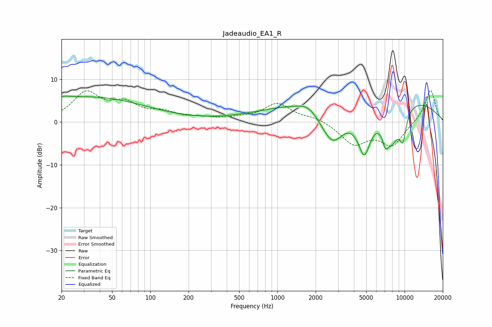

# Jadeaudio_EA1_R
See [usage instructions](https://github.com/jaakkopasanen/AutoEq#usage) for more options and info.

### Parametric EQs
Apply preamp of -6.2 dB when using parametric equalizer.

|   # | Type    |   Fc (Hz) |    Q |   Gain (dB) |
|-----|---------|-----------|------|-------------|
|   1 | Peaking |        20 | 4.51 |        -0.2 |
|   2 | Peaking |        20 | 2.63 |         1   |
|   3 | Peaking |        33 | 0.32 |         5.8 |
|   4 | Peaking |      1758 | 1.94 |         1.7 |
|   5 | Peaking |      2707 | 1.28 |       -10.6 |
|   6 | Peaking |      4827 | 2.45 |       -10.8 |
|   7 | Peaking |      4862 | 0.19 |         8.1 |
|   8 | Peaking |      7064 | 5.81 |        -3.3 |
|   9 | Peaking |      7927 | 1.84 |        -9.1 |
|  10 | Peaking |      9705 | 4.55 |        -6.2 |

### Fixed Band EQs
When using fixed band (also called graphic) equalizer, apply preamp of **-7.5 dB** (if available) and set gains manually with these parameters.

|   # | Type    |   Fc (Hz) |    Q |   Gain (dB) |
|-----|---------|-----------|------|-------------|
|   1 | Peaking |        31 | 1.41 |         6.5 |
|   2 | Peaking |        62 | 1.41 |         3.7 |
|   3 | Peaking |       125 | 1.41 |         1.9 |
|   4 | Peaking |       250 | 1.41 |         0.7 |
|   5 | Peaking |       500 | 1.41 |         0.6 |
|   6 | Peaking |      1000 | 1.41 |         4.2 |
|   7 | Peaking |      2000 | 1.41 |         1   |
|   8 | Peaking |      4000 | 1.41 |        -5   |
|   9 | Peaking |      8000 | 1.41 |        -5.3 |
|  10 | Peaking |     16000 | 1.41 |         7.7 |

### Graphs

