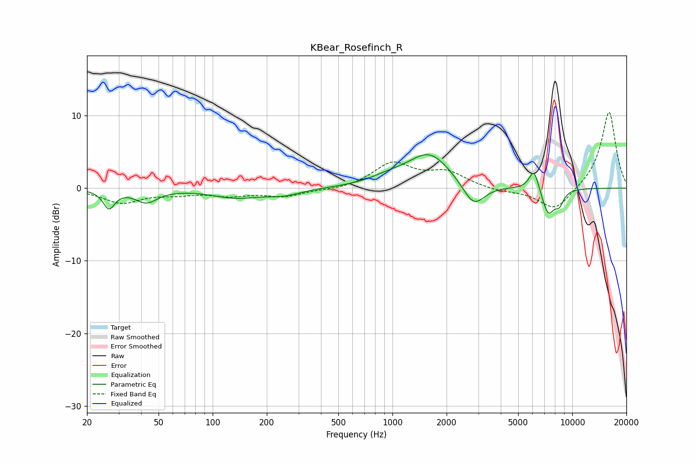

# KBear_Rosefinch_R
See [usage instructions](https://github.com/jaakkopasanen/AutoEq#usage) for more options and info.

### Parametric EQs
Apply preamp of -4.7 dB when using parametric equalizer.

|   # | Type    |   Fc (Hz) |    Q |   Gain (dB) |
|-----|---------|-----------|------|-------------|
|   1 | Peaking |        27 | 4.46 |        -2.5 |
|   2 | Peaking |        43 | 2.32 |        -1.8 |
|   3 | Peaking |       134 | 1.06 |        -1.2 |
|   4 | Peaking |       249 | 1.47 |        -0.8 |
|   5 | Peaking |       952 | 1.29 |         0.9 |
|   6 | Peaking |      1608 | 1.18 |         4.7 |
|   7 | Peaking |      2827 | 2.31 |        -3.4 |
|   8 | Peaking |      6127 | 5    |         3   |
|   9 | Peaking |      7344 | 3.82 |        -3.6 |
|  10 | Peaking |      8475 | 5.37 |        -1.7 |

### Fixed Band EQs
When using fixed band (also called graphic) equalizer, apply preamp of **-10.5 dB** (if available) and set gains manually with these parameters.

|   # | Type    |   Fc (Hz) |    Q |   Gain (dB) |
|-----|---------|-----------|------|-------------|
|   1 | Peaking |        31 | 1.41 |        -2   |
|   2 | Peaking |        62 | 1.41 |        -0.6 |
|   3 | Peaking |       125 | 1.41 |        -0.9 |
|   4 | Peaking |       250 | 1.41 |        -1.1 |
|   5 | Peaking |       500 | 1.41 |        -0.3 |
|   6 | Peaking |      1000 | 1.41 |         3.3 |
|   7 | Peaking |      2000 | 1.41 |         2   |
|   8 | Peaking |      4000 | 1.41 |        -0.4 |
|   9 | Peaking |      8000 | 1.41 |        -3.2 |
|  10 | Peaking |     16000 | 1.41 |        10.7 |

### Graphs

