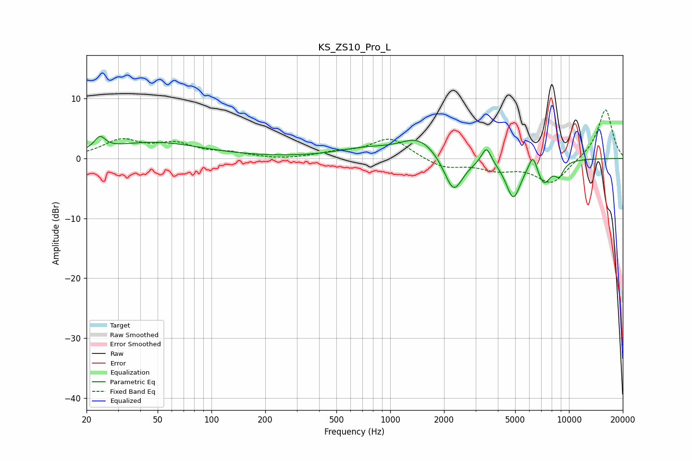

# KS_ZS10_Pro_L
See [usage instructions](https://github.com/jaakkopasanen/AutoEq#usage) for more options and info.

### Parametric EQs
Apply preamp of -3.8 dB when using parametric equalizer.

|   # | Type    |   Fc (Hz) |    Q |   Gain (dB) |
|-----|---------|-----------|------|-------------|
|   1 | Peaking |        24 | 4.75 |         2.1 |
|   2 | Peaking |        48 | 0.53 |         2.6 |
|   3 | Peaking |       716 | 0.89 |         1.4 |
|   4 | Peaking |      1455 | 1.33 |         3.3 |
|   5 | Peaking |      2262 | 2.65 |        -6.2 |
|   6 | Peaking |      3454 | 5.29 |         2.9 |
|   7 | Peaking |      4882 | 3.35 |        -6.4 |
|   8 | Peaking |      6286 | 6    |         2.9 |
|   9 | Peaking |      7249 | 3.55 |        -3.7 |
|  10 | Peaking |      8825 | 5.16 |        -2.1 |

### Fixed Band EQs
When using fixed band (also called graphic) equalizer, apply preamp of **-8.2 dB** (if available) and set gains manually with these parameters.

|   # | Type    |   Fc (Hz) |    Q |   Gain (dB) |
|-----|---------|-----------|------|-------------|
|   1 | Peaking |        31 | 1.41 |         2.9 |
|   2 | Peaking |        62 | 1.41 |         2.2 |
|   3 | Peaking |       125 | 1.41 |         0.7 |
|   4 | Peaking |       250 | 1.41 |        -0.3 |
|   5 | Peaking |       500 | 1.41 |         0.8 |
|   6 | Peaking |      1000 | 1.41 |         3.4 |
|   7 | Peaking |      2000 | 1.41 |        -1.6 |
|   8 | Peaking |      4000 | 1.41 |        -1.6 |
|   9 | Peaking |      8000 | 1.41 |        -4.2 |
|  10 | Peaking |     16000 | 1.41 |         8.4 |

### Graphs

