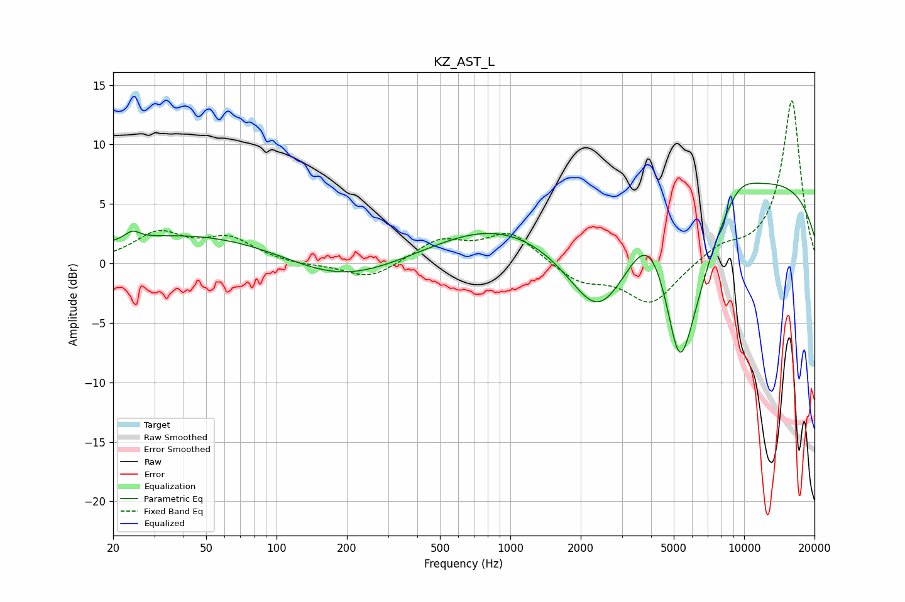

# KZ_AST_L
See [usage instructions](https://github.com/jaakkopasanen/AutoEq#usage) for more options and info.

### Parametric EQs
Apply preamp of -6.8 dB when using parametric equalizer.

|   # | Type    |   Fc (Hz) |    Q |   Gain (dB) |
|-----|---------|-----------|------|-------------|
|   1 | Peaking |        24 | 4.67 |         0.7 |
|   2 | Peaking |        46 | 0.33 |         2.6 |
|   3 | Peaking |       184 | 0.59 |        -2.2 |
|   4 | Peaking |       832 | 0.52 |         2.9 |
|   5 | Peaking |      2389 | 1    |        -7.9 |
|   6 | Peaking |      3927 | 1.63 |         3.8 |
|   7 | Peaking |      5264 | 2.97 |        -5.4 |
|   8 | Peaking |      5626 | 1.17 |        -9.8 |
|   9 | Peaking |      9443 | 0.19 |         7.6 |
|  10 | Peaking |      9470 | 1.6  |         1.8 |

### Fixed Band EQs
When using fixed band (also called graphic) equalizer, apply preamp of **-13.8 dB** (if available) and set gains manually with these parameters.

|   # | Type    |   Fc (Hz) |    Q |   Gain (dB) |
|-----|---------|-----------|------|-------------|
|   1 | Peaking |        31 | 1.41 |         2.4 |
|   2 | Peaking |        62 | 1.41 |         1.9 |
|   3 | Peaking |       125 | 1.41 |        -0.2 |
|   4 | Peaking |       250 | 1.41 |        -1.4 |
|   5 | Peaking |       500 | 1.41 |         1.9 |
|   6 | Peaking |      1000 | 1.41 |         2.5 |
|   7 | Peaking |      2000 | 1.41 |        -1.6 |
|   8 | Peaking |      4000 | 1.41 |        -3.4 |
|   9 | Peaking |      8000 | 1.41 |         1.2 |
|  10 | Peaking |     16000 | 1.41 |        13.8 |

### Graphs

